# Couleurs pour l'Observatoire de la Santé et du Social

Nous avons créé des palettes spécifiques pour les chercheurs de
l’Observatoire de la Santé et du Social. Celles-ci suivent le code
couleur de [Vivalis](https://www.vivalis.brussels), et ont été pensées
pour différentes utilisations.

## Utilisation

Pour utiliser ces palettes dans les différentes fonctions de
`fonctionr`, il suffit d’indiquer celle de votre préférence (les noms
des palettes de couleur sont listés plus loin sur cette page) dans
l’argument `pal` :

``` r
test_palette_OBSS <- distrib_group_d(
  eusilc,
  group = db040,
  quali_var = pl030_rec,
  weights = rb050,
  font = "Gotham Narrow",
  pal = "OBSS",
  title = "Distribution of socio-economic status according to region",
  ylab = "",
  legend_lab = "Status",
  caption = "Bron : EU-SILC",
)
test_palette_OBSS$graph
```

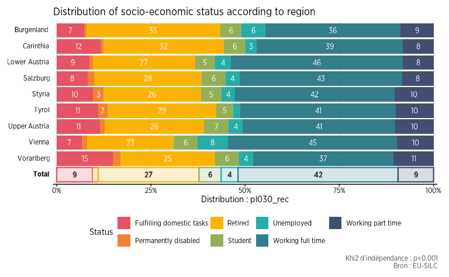

Les codes hexadécimaux des différentes palettes peuvent aussi être
appelés avec la fonction
[`official_pal()`](https://jgires.github.io/fonctionr/reference/official_pal.md),
pour les utiliser à l’extérieur de `fonctionr`. L’argument `n` permet
d’indiquer combien de couleurs sont nécessaires, et la fonction s’occupe
de créer automatiquement un dégradé comprenant ce nombre de couleurs.
L’argument `show_pal = T` permet quant à lui d’afficher graphiquement
les palettes.

``` r
official_pal(inst = "OBSS", n = 8)
#> [1] "#E65362" "#EF7C3B" "#F8A514" "#BEB135" "#63AE7A" "#2A9FA0" "#367689"
#> [8] "#434E73"
official_pal(inst = "OBSS", n = 8, show_pal = T)
```

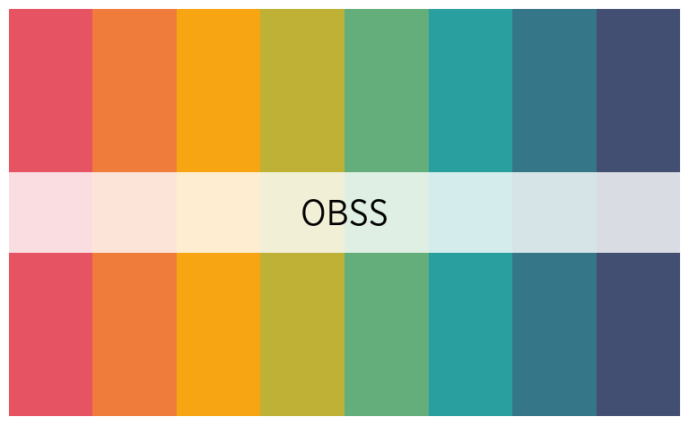

Il est également possible de connaître toutes les palettes disponibles
en exécutant la fonction
[`official_pal()`](https://jgires.github.io/fonctionr/reference/official_pal.md)
avec comme argument `list_pal_names = T` :

``` r
official_pal(list_pal_names = T)
#>  [1] "Vivalis"         "OBSS"            "OBSS_alt1"       "OBSS_alt2"      
#>  [5] "OBSS_alt3"       "OBSS_Relax"      "OBSS_Autumn"     "OBSS_Sweet"     
#>  [9] "OBSS_Spring"     "OBSS_Candy"      "OBSS_Candy2"     "OBSS_Greens"    
#> [13] "OBSS_Greens2"    "OBSS_Sea"        "OBSS_Sea2"       "OBSS_Sunset"    
#> [17] "OBSS_Sunset2"    "OBSS_Purples"    "OBSS_Purples2"   "OBSS_Blues"     
#> [21] "OBSS_Blues2"     "OBSS_Brown"      "OBSS_Brown2"     "OBSS_div_mid1"  
#> [25] "OBSS_div_mid2"   "OBSS_div_mid3"   "OBSS_div_mid4"   "OBSS_div_bi1"   
#> [29] "OBSS_div_bi2"    "OBSS_div_bi3"    "OBSS_div_bi4"    "OBSS_highlight1"
#> [33] "OBSS_highlight2" "OBSS_highlight3" "OBSS_old"        "IBSA"           
#> [37] "ULB"
```

## Les palettes

### Palettes qualitatives

``` r
official_pal("OBSS", 8, show_pal = T)
```


``` r
official_pal("OBSS_alt1", 8, show_pal = T)
```


``` r
official_pal("OBSS_alt2", 7, show_pal = T)
```

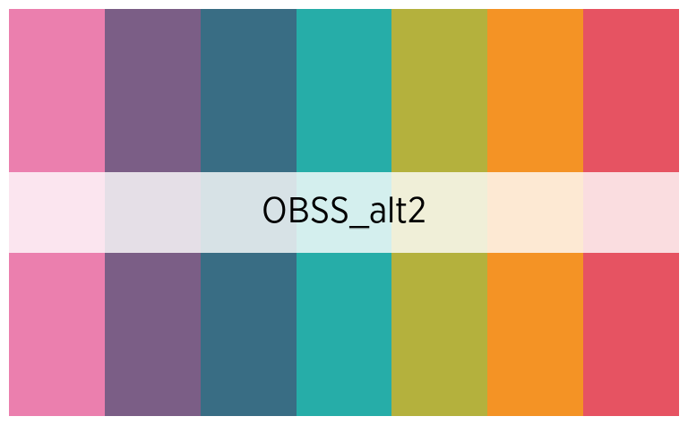

``` r
official_pal("OBSS_alt3", 8, show_pal = T)
```

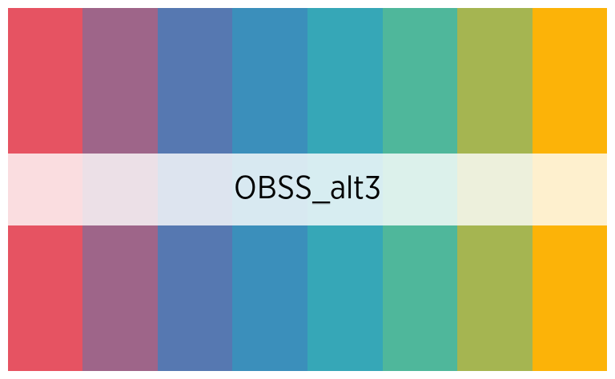

``` r
official_pal("OBSS_Autumn", 8, show_pal = T)
```

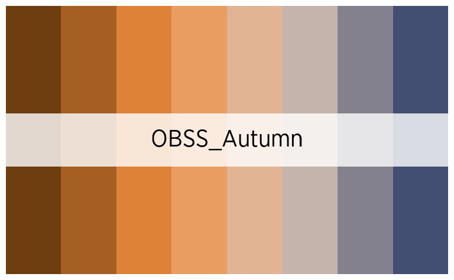

``` r
official_pal("OBSS_Relax", 7, show_pal = T)
```


``` r
official_pal("OBSS_Spring", 7, show_pal = T)
```


``` r
official_pal("OBSS_Sweet", 7, show_pal = T)
```


### Palettes continues

``` r
official_pal("OBSS_Greens", 8, show_pal = T)
```

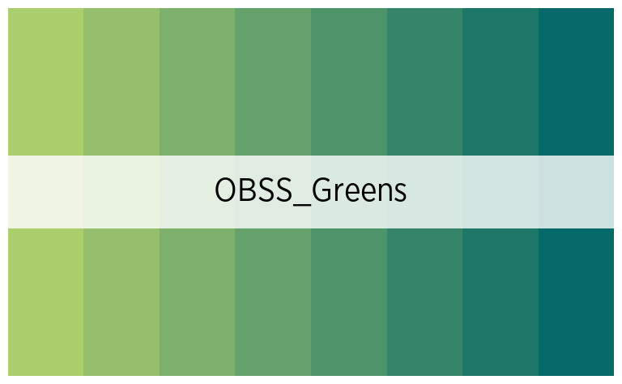

``` r
official_pal("OBSS_Sunset", 8, show_pal = T)
```

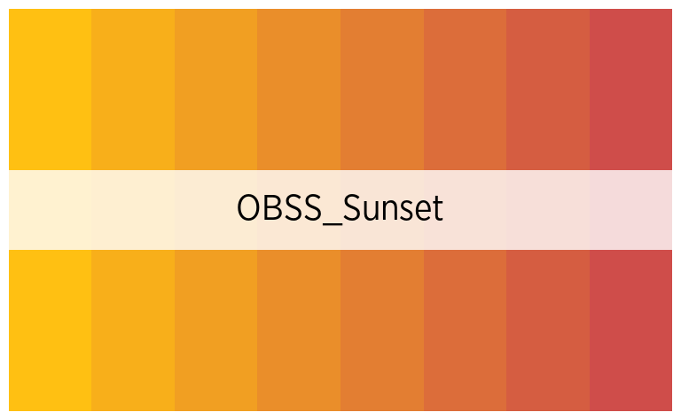

``` r
official_pal("OBSS_Sea", 8, show_pal = T)
```

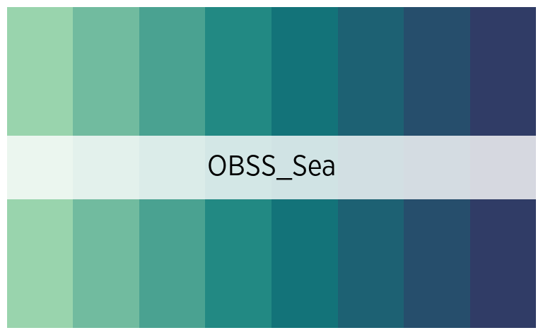

``` r
official_pal("OBSS_Candy", 8, show_pal = T)
```

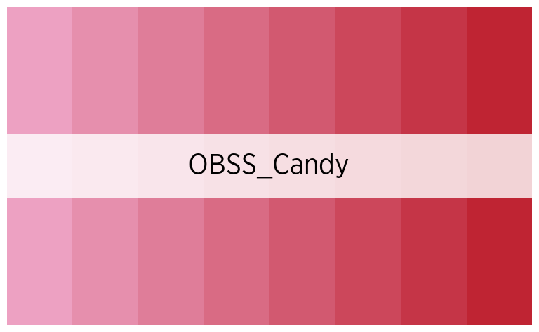

``` r
official_pal("OBSS_Purples", 8, show_pal = T)
```


``` r
official_pal("OBSS_Blues", 8, show_pal = T)
```


``` r
official_pal("OBSS_Brown", 8, show_pal = T)
```


### Palettes divergentes

#### Avec un point central

*Attention, ces palettes n’affichent le point central que si le nombre
de couleur est impair !*

``` r
official_pal("OBSS_div_mid1", 7, show_pal = T)
```

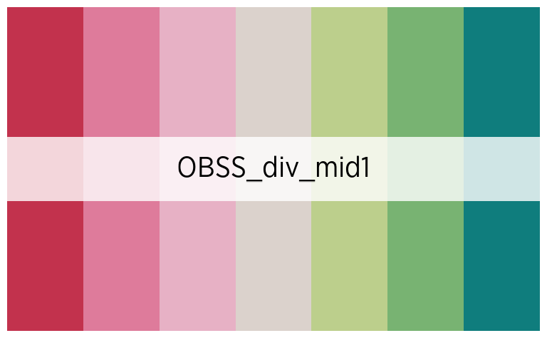

``` r
official_pal("OBSS_div_mid2", 7, show_pal = T)
```


``` r
official_pal("OBSS_div_mid3", 7, show_pal = T)
```

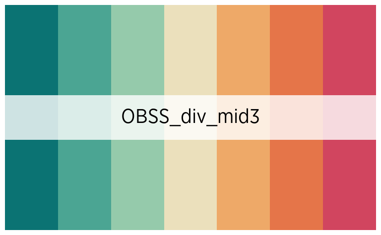

``` r
official_pal("OBSS_div_mid4", 7, show_pal = T)
```

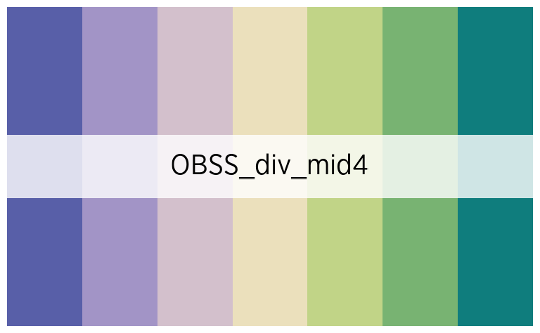

#### Sans point central

*Attention, ces palettes ne sont symétriques que si le nombre de couleur
est pair !*

``` r
official_pal("OBSS_div_bi1", 8, show_pal = T)
```


``` r
official_pal("OBSS_div_bi2", 8, show_pal = T)
```


``` r
official_pal("OBSS_div_bi3", 8, show_pal = T)
```


``` r
official_pal("OBSS_div_bi4", 8, show_pal = T)
```


### Palettes avec emphase

Il s’agit de palettes de couleur mettant en opposition la première, ou
les deux premières catégories, avec toutes les autres :

``` r
official_pal("OBSS_highlight1", 8, show_pal = T)
```

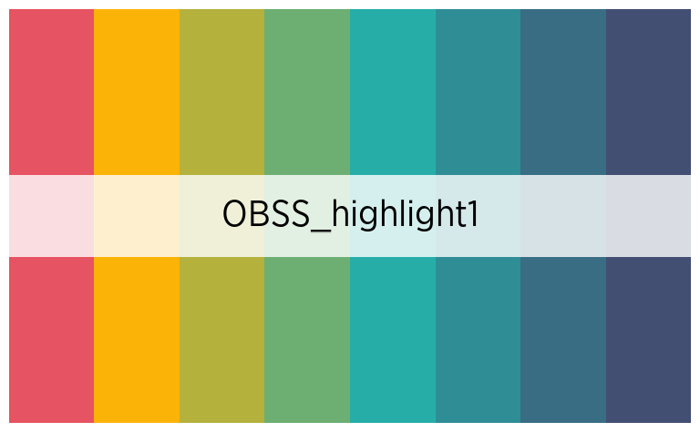

``` r
official_pal("OBSS_highlight2", 8, show_pal = T)
```


``` r
official_pal("OBSS_highlight3", 8, show_pal = T)
```


### Palettes d’autres institutions

``` r
official_pal("IBSA", 4, show_pal = T)
```


``` r
official_pal("ULB", 6, show_pal = T)
```


## Altération des palettes

Il est possible de désaturer, éclaircir ou foncer les palettes, avec les
arguments `desaturate`, `lighten` et `darken`, à la fois dans les
fonctions de description de données de `fonctionr` et dans la fonction
[`official_pal()`](https://jgires.github.io/fonctionr/reference/official_pal.md).

``` r
official_pal("OBSS", 8, show_pal = T)
```


``` r
official_pal("OBSS", 8, desaturate = .4, show_pal = T)
```

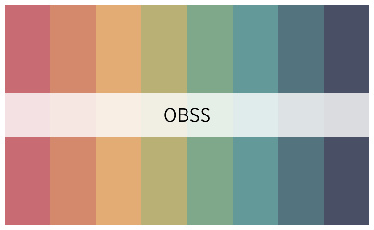

``` r
official_pal("OBSS", 8, lighten = .4, show_pal = T)
```


``` r
official_pal("OBSS", 8, darken = .4, show_pal = T)
```


## Exemples de graphiques

``` r
distrib_income_2 <- distrib_group_c(
  eusilc,
  db040,
  (py010n + py050n) / 12,
  filter_exp = pl030 == 2,
  limits = c(-500, 3000),
  show_mid_point = F,
  show_value = F,
  show_ci_errorbar = F,
  show_moustache = F,
  pal = official_pal(inst = "OBSS_Purples", n = 2, direction = -1),
  alpha = .8,
  font = "Gotham Narrow",
  title = "Income from wage, part time workers by region"
)

distrib_income_2$graph
```


``` r
eusilc_dist_group_d <- distrib_group_d(
  eusilc,
  group = db040,
  quali_var = pl030_rec,
  filter_exp = age > 12,
  pal = "OBSS_alt1",
  font = "Gotham Narrow",
  title = "Distribution of socio-economic status according to region"
  )

eusilc_dist_group_d$graph
```


``` r
eusilc_many_mean_group <- many_mean_group(
  eusilc,
  group = rb090,
  list_vars = c(py010n, py050n, py090n),
  list_vars_lab = c("salaires", "revenus d'une activité indépendant", "allocation de chômage"),
  pal = "OBSS_Greens",
  unit = "€",
  font = "Gotham Narrow",
  title = "Income from wage, independant worker and unemployement benefits by sex"
  )

eusilc_many_mean_group$graph
```

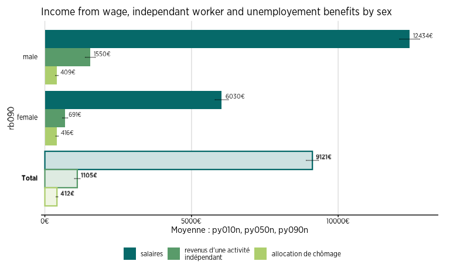

``` r
eusilc_dist_group_d2 <- distrib_group_d(
  eusilc,
  weights = rb050,
  group = pb220a,
  quali_var = pl030_rec,
  pal = "OBSS_Autumn",
  font = "Gotham Narrow",
  title = "Distribution of socio-economic status according to nationality"
  )

eusilc_dist_group_d2$graph
```


``` r
eusilc_prop_group <- prop_group(
  eusilc,
  group = rb090,
  prop_exp = pl030_rec == "Working part time",
  group.fill = db040,
  show_value = F,
  pal = "OBSS_alt2",
  font = "Gotham Narrow",
  title = "Proportion of individuals working part time by region and sex"
)

eusilc_prop_group$graph
```

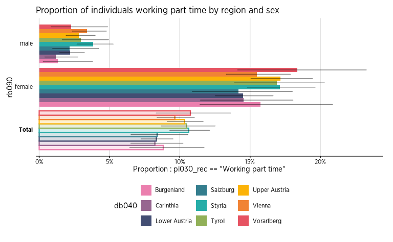
