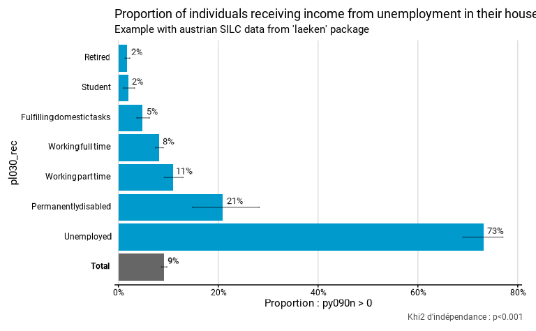
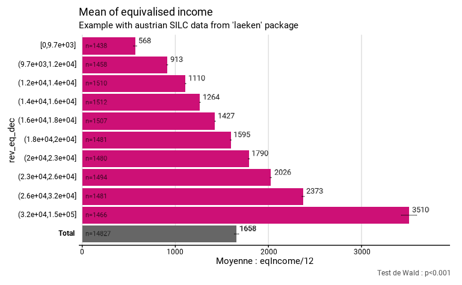
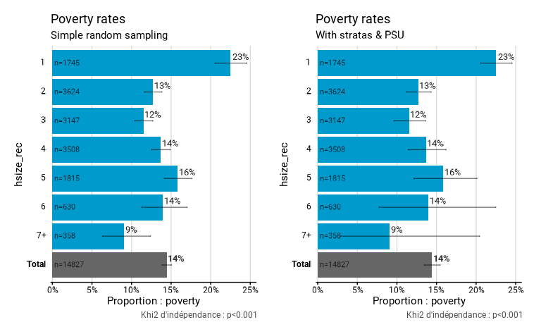

# Complex design

L’objectif de `fonctionr` est de faciliter la manipulation de données
individuelles issues de sondages avec un design complexe, c’est-à-dire
de prendre en compte facilement la stratification, les unités primaires
d’échantillonnage (PSU) et la pondération dans le calcul des indicateurs
et les mesures d’incertitude (les intervalles de confiance, par
exemple).

``` r
library(fonctionr)
library(survey)
library(patchwork)
```

## Préambule

### Qu’est-ce qu’un sondage ?

Pour produire des informations sur la population, on réalise souvent des
sondages sur un **échantillon**, sur lequel on réalise une enquête. On
parle de sondage dès que l’on enquête un échantillon, c’est-à-dire un
sous-ensemble de la **population**. Le mot “sondage” est souvent associé
aux enquêtes pré-électorales ou d’opinion. Les sondages ne se limitent
en réalité pas à ces domaines : les grandes enquêtes européennnes SILC,
EFT, EWCS, PISA, ESS… sont par exemple des sondages.

On enquête un échantillon plutôt que la population pour des raisons
pratiques et financières : enquêter toute la population coûte un prix
astronomique, et est très compliqué à organiser (nécessite un grand
nombre d’enquêteur-trice-s, qui doivent réaliser des nombreux
déplacements pénibles, etc.). Par ailleurs, les enquêtes exhaustives (=
recensements) ne peuvent être réalisées qu’à des périodes relativement
espacées et sont limitées en terme de contenu, pour les raisons
pratiques évoquées.

Cependant, *travailler sur un échantillon implique des **procédures
complexes** dans l’analyse*, qui demandent la mobilisation et la
compréhension de la théorie de la **statistique inférentielle**. Sa mise
en pratique ne s’improvise pas et demande un apprentissage minimal :
c’est l’objet de cette page d’en faire l’introduction.

### Qu’est-ce qu’un bon échantillon (probabiliste) ?

Un échantillon est souvent présenté comme un “modèle réduit” de la
population, dont la qualité première serait la “représentativité”,
c’est-à-dire la même répartition des catégories que dans la population.
Il s’agit de la manière dont a été popularisée la condition de validité
des enquêtes, qui est pourtant assez trompeuse ! En réalité, les
statisticiens n’utilisent pas la notion de “représentativité”, et
celle-ci est souvent utilisée à tort et à travers. Par exemple, il est
souvent utile de sur-représenter ou sous-représenter certaines
catégories de la population dans le sondage, ce qui engendre de facto
que l’échantillon n’est plus “représentatif” au sens strict. De plus, la
représentativité de l’échantillon est impossible à connaître pour les
éléments inconnus, ceux pour lesquels on réalise justement l’enquête !

Ce qui est réellement important dans un sondage, c’est :

- Que la sélection des individus soit aléatoire, **et** que cette
  sélection aléatoire s’opère selon un plan défini et connu.

- Qu’il n’y ait pas de biais dans l’échantillon, possiblement du fait
  d’un taux de réponse plus bas de certaines catégories par rapport à
  d’autres.

- Que la diversité des situations dans l’échantillon soit aussi riche
  que celle dans la population.

En comparaison de ces éléments, la taille de l’échantillon, critère dont
on parle beaucoup, est peu garant de qualité. **Un petit échantillon
bien fait est beaucoup plus intéressant qu’un grand échantillon mal
construit**, dont les résultats seront biaisés et peu utilisables.

## Un hasard prédictible

### La fluctuation d’échantillonnage

L’échantillon doit être le produit d’une sélection aléatoire. En tout
cas, c’est la condition pour pouvoir faire de l’**inférence
statistique**, c’est-à-dire induire de manière fiable les
caractéristiques de la population sur la base d’un échantillon, qui n’en
est qu’une sélection partielle ! Il existe des échantillons non
probabilistes, mais inférer les caractéristiques observées à la
population est beaucoup moins solide et beaucoup plus risqué.

Il faut savoir que la sélection d’un échantillon est soumise au hasard,
qui implique une **fluctuation d’échantillonnage**. Autrement dit, le
hasard de l’échantillonnage fait que l’*on n’obtient jamais exactement
le vrai résultat*, celui dans la population ! C’est la raison pour
laquelle on parle toujours d’**estimation** lorsqu’on s’intéresse au
résultat dans un échantillon. Par exemple, des groupes qui ont en
réalité la même moyenne dans la population pourraient obtenir des
estimations de leurs moyennes différentes dans l’échantillon. On
comprend que le risque est de conclure trop rapidement à une différence
entre ces groupes dans la population sur base des résultat dans
l’échantillon, **alors que cette différence n’existe tout simplement
pas** *!*

Il s’agit là de l’élément qui rend l’analyse de données d’enquête plus
compliquées que celle de chiffres issus de la population. L’intérêt de
la statistique inférentielle est qu’elle permet de réduire largement le
risque de se tromper. Elle permet notamment de calculer des
**intervalles de confiance**, et de procéder à des **tests
statistiques**, qui permettent de baliser ce risque.

### La distribution d’échantillonnage

Par quel miracle l’inférence est-elle possible, sans même connaître les
caractéritiques de la population ? C’est parce que le hasard suit des
règles connues que l’on peut faire de l’inférence. Si on tire des
milliers d’échantillons aléatoires à partir de la même population, on
peut observer comment se distribue la moyenne de ces échantillons. Il
s’agit en termes statistiques de la **distribution d’échantillonnage**.
Et la distribution d’échantillonnage de la moyenne suit une loi bien
connue : une **loi normale**. Par ailleurs, la moyenne de cette
distribution est égale à la moyenne réelle ! Malgré la fluctuation
d’échantillonnage, l’estimation de la moyenne dans l’échantillon tend
donc à être égale à la moyenne réelle dans la population. On dit que la
moyenne d’échantillon est un estimateur **non biaisé** de la moyenne
dans la population. Ce sont précisément ces éléments qui rendent
possibles l’inférence et qui permettent de calculer des intervalles de
confiance et de procéder aux tests statistiques.

Il faut bien avoir à l’esprit que la distribution d’échantillonnage est
**estimée théoriquement** selon les caractéristiques de l’échantillon.
Il faut donc toujours bien faire attention à ce que les conditions
soient remplies pour estimer correctement la distribution
d’échantillonnage (conditions de distribution des variables, du nombre
d’effectifs, etc.). La distribution d’échantillonnage ne suit par
exemple pas toujours une loi normale. Par ailleurs, même lorsqu’elle est
normale, la distribution d’échantillonnage peut avoir une variance
(“largeur”) plus ou moins grande, notamment si la variance de la
variable dont on estime la moyenne est grande. Il est facile de le
comprendre en imaginant une situation où la variance est nulle : si tous
les individus ont la même caractéristique dans la population, la
distribution d’échantillonnage ne présentera qu’une unique valeur et
l’estimation de la moyenne de cette caractéristique dans un échantillon
sera très précise puisqu’elle sera toujours la même.

Toute la difficulté de la statistique inférentielle est de bien estimer
quelle serait la distribution d’échantillonnage (forme,
caractéristiques) des estimateurs que l’on utilise (= les résultats que
l’on calcule : des moyennes, proportions…), afin de pouvoir faire des
tests statistiques ou calculer des intervalles de confiance adaptés aux
données.

## Outils de la statistique inférentielle

### Tests d’hypothèse

Imaginons que l’on veuille être assurés que la différence des moyennes
constatée dans l’échantillon entre 2 groupes est réelle (= se retrouve
dans la population). Pour cela, on peut faire un **test d’hypothèse**.
Les tests d’hypothèses reposent entièrement sur les caractéristiques de
la distribution d’échantillonnage. Le test agit en quelque sorte comme
une expérience de pensée qui repose sur cette question : “*et s’il n’y
avait en réalité pas de différence malgré celle que l’on constate ?*” le
test fournit la probabilité de trouver une différence au moins aussi
grande que celle que l’on constate alors qu’il n’y en a en réalité
aucune dans la population (sous l’hypothèse que la différence entre les
deux groupes vaut 0, si on le dit plus formellement). Le principe est
que si cette probabilité est trop faible, alors on **rejette**
l’hypothèse que les groupes seraient les mêmes dans la population (et on
conclut alors à une différence). Cette expérience de pensée est l’astuce
qu’on trouvée les statisticiens pour prendre une décision en l’absence
d’autres éléments. La contrepartie de cette “astuce” est néanmoins forte
: l’échantillon doit être aléatoire et non biaisé, et on doit connaître
le type de sélection aléatoire (= le plan de sondage), pour estimer
correctement la distribution d’échantillonnage.

### Intervalles de confiance

Un autre élément fondamental de la statistique inférentielle est
l’**intervalle de confiance**. Celui-ci est souvent présenté comme
l’intervalle dans lequel il y a X % de chance que se situe la valeur
réelle. Cette interprétation n’est pas correcte, car la valeur réelle
est une constante : elle *est* ou *n’est pas* dans l’intervalle. La
probabilité est donc soit de 100%, soit de 0%. L’objectif de
l’intervalle de confiance est en réalité de montrer que notre mesure
*ponctuelle* dans l’échantillon est un produit de la fluctuation
d’échantillonnage, et qu’elle est assortie d’une incertitude.
L’intervalle de confiance rappelle que si on avait tiré un autre
échantillon aléatoire, *la valeur du résultat dans l’échantillon aurait
été différente !* Il invite ainsi à considérer le résultat non comme une
valeur, mais *une plage de valeurs possibles*.

Techniquement, l’intervalle de confiance est déterminé sur base de
l’estimation de la distribution d’échantillonnage et est par
construction centré autour de la moyenne d’échantillon. Il indique
toutes les valeurs possibles de la moyenne d’échantillon si la vraie
moyenne était celle que l’on observe, avec la distribution
d’échantillonnage que l’on estime dans l’échantillon. Mais il faut bien
se rendre compte que l’on estime tout cela via l’échantillon dont on
dispose, lui-même soumis à la fluctuation d’échantillonnage : on est
peut-être dans le cas où la moyenne d’échantillon est fort éloignée de
la moyenne réelle ou celui où la distribution d’échantillonnage est mal
estimée via l’échantillon ; l’intervalle de confiance peut alors ne pas
comprendre la vraie valeur !

L’intervalle de confiance se réfère en réalité à une perspective
d’échantillonnage répété : *un intervalle de confiance à un niveau de
confiance de X % est un intervalle qui capture la valeur réelle dans la
population dans X % des échantillons, *si on répétait l’échantillonnage
un grand nombre de fois**.

Comprendre précisément ce qu’est un intervalle de confiance permet de
mieux comprendre les résultats obtenus. Cela permet notamment de se
rendre compte que tendanciellement, si tout est fait dans les règles de
l’art, *5% des intervalles de confiance dans un rapport ne comprennent
*PAS* la vraie valeur !* C’est peu et à la fois beaucoup… Mais c’est
inévitable et c’est l’erreur minimale : si les intervalles de confiances
sont mal estimés, cette erreur est certainement supérieure. Si les
intervalles de confiance ne sont pas calculés du tout, alors,
strictement parlant, la valeur estimée dans l’échantillon est
**toujours** erronée : elle n’est **jamais** exactement celle de la
population. C’est la raison pour laquelle il est plus cohérent de
considérer les résultats issus d’un échantillon comme des **plages
possibles**.

Notre package `fonctionr` produit à la fois les intervalles de confiance
et un test statistique le plus adapté au calcul demandé, sur base du
design réel de l’enquête. Ci-dessous, on calcule la proportion à
recevoir des revenus du chômage (`py090n` supérieurs à 0). On indique
que les strates sont les régions (`strata = db040`) et les PSU sont les
ménages (`ids = db030`).

``` r
# Loading of data
data(eusilc, package = "laeken")

# Recoding eusilc$pl030 into eusilc$pl030_rec
eusilc$pl030_rec <- NA
eusilc$pl030_rec[eusilc$pl030 == "1"] <- "Working full time"
eusilc$pl030_rec[eusilc$pl030 == "2"] <- "Working part time"
eusilc$pl030_rec[eusilc$pl030 == "3"] <- "Unemployed"
eusilc$pl030_rec[eusilc$pl030 == "4"] <- "Student"
eusilc$pl030_rec[eusilc$pl030 == "5"] <- "Retired"
eusilc$pl030_rec[eusilc$pl030 == "6"] <- "Permanently disabled"
eusilc$pl030_rec[eusilc$pl030 == "7"] <- "Fulfilling domestic tasks"

eusilc_prop <- prop_group(
  eusilc,
  group = pl030_rec,
  prop_exp = py090n > 0,
  strata = db040,
  ids = db030,
  weight = rb050,
  reorder = T,
  title = "Proportion of individuals receiving income from unemployment in their household",
  subtitle = "Example with austrian SILC data from 'laeken' package"
)
```

Les intervalles de confiance et le résultat du test statistique sont
affichés sur le graphique. Dans le cas de `prop_test()`, le test
d’hypothèse est un khi2 avec comme hypothèse nulle l’égalité de toutes
les proportions.

``` r
eusilc_prop$graph
```



Les intervalles de confiance se trouvent sous forme de données dans le
dataframe `tab` avec les résultats :

``` r
eusilc_prop$tab
#> # A tibble: 8 × 11
#>   pl030_rec                   prop prop_low prop_upp n_sample n_true_weighted
#>   <fct>                      <dbl>    <dbl>    <dbl>    <int>           <dbl>
#> 1 Fulfilling domestic tasks 0.0485   0.0369   0.0624     1207          31048.
#> 2 Permanently disabled      0.209    0.148    0.282       178          21975.
#> 3 Retired                   0.0177   0.0134   0.0229     3146          31988.
#> 4 Student                   0.0194   0.0106   0.0323      736           7666.
#> 5 Unemployed                0.732    0.690    0.770       518         221878.
#> 6 Working full time         0.0818   0.0741   0.0899     5162         234629.
#> 7 Working part time         0.110    0.0921   0.130      1160          69869.
#> 8 Total                     0.0916   0.0863   0.0971    12107         619054.
#> # ℹ 5 more variables: n_true_weighted_low <dbl>, n_true_weighted_upp <dbl>,
#> #   n_tot_weighted <dbl>, n_tot_weighted_low <dbl>, n_tot_weighted_upp <dbl>
```

Les résultats du test se trouvent dans l’objet `test.stat` :

``` r
eusilc_prop$test.stat
#> 
#>  Pearson's X^2: Rao & Scott adjustment
#> 
#> data:  NextMethod()
#> F = 475.2, ndf = 5.9608, ddf = 35711.0201, p-value < 2.2e-16
```

## Ce qui influence la précision statistique :

Trois éléments influencent la précision statistique (entendue comme
p-valeur d’un test et taille d’un intervalle de confiance).

### 1° La manière dont la (ou les) variable(s) se distribue(nt) dans la population

Pour une moyenne, plus la variance de la variable d’intérêt est grande,
plus l’intervalle de confiance le sera aussi. Cet effet est important,
mais par définition on ne peut pas le contrôler. Voici par exemple la
moyenne du revenu équivalent par décile de revenu, calculé à partir de
SILC en Autriche. Les effectifs de l’échantillon pour chacun des déciles
sont semblables. Pourtant, les intervalles de confiance sont différents.
On remarque notamment que le dernier décile a un intervalle plus grand.
Cela indique indirectement que la variance de cette variable est plus
élevée pour le dixième décile (ce qui est cohérent, les revenu
s’étendant jusque très haut pour cette dernière catégorie).

Cet élément est notamment la raison pour laquelle on stratifie un
échantillon, c’est-à-dire qu’on découpe la population en strates dans
lesquelles on va faire des tirages aléatoire séparés (voir plus bas).
Dans ce cas, on pourrait augmenter le taux de sondage dans le 10ème
décile, pour augmenter la précision des indicateurs relatifs au revenu
pour ce décile (ce qui se manifesterait pour une diminution de
l’intervalle de confiance). Ce point renvoie au fait qu’il est
*important de construire un échantillon dont on maximise la diversité* !

``` r
# Creation of deciles
svyeusilc <- svydesign(id = ~db030, strata = ~db040, weights = ~rb050, data = eusilc)
quant <- svyquantile(~eqIncome, svyeusilc, quantiles = seq(.1, .9, .1), ci = F)[[1]]
eusilc$rev_eq_dec <- cut(
  eusilc$eqIncome,
  breaks = c(min(eusilc$eqIncome), quant, max(eusilc$eqIncome)),
  include.lowest = T,
  dig.lab = 0
  )

# Computation with fonctionr
eusilc_mean <- mean_group(
  eusilc,
  group = rev_eq_dec,
  quanti_exp = eqIncome / 12,
  strata = db040,
  ids = db030,
  weight = rb050,
  show_n = T,
  title = "Mean of equivalised income",
  subtitle = "Example with austrian SILC data from 'laeken' package",
  )
```

``` r
eusilc_mean$graph
```



### 2° La taille de l’échantillon

Un échantillon plus grand sera plus précis. Apportons cependant deux
précisions.

Premièrement, contrairement à ce qu’on imagine parfois intuitivement ,
le taux de sondage (= la part de la population interrogée) n’a pas
d’effet. Ainsi, un échantillon de 1000 personnes dans une commune de
Belgique sera aussi précis (pour dire des choses sur les habitants de
cette commune) qu’un échantillon de 1000 personnes aux États-Unis (pour
dire des choses sur les Américains). En théorie, il y a un léger effet
du taux de sondage quand celui-ci est très important - par exemple si
l’on constitue un échantillon reprenant 10%, 20% ou 50% de la population
de référence. Mais dans la pratique, nous n’avons jamais été confrontés
à un échantillon avec un taux de sondage si grand. Peut-être que si on a
les moyens de constituer un échantillon de 50% de la population, on a
les moyen d’interroger tout le monde à l’aide d’un recensement
exhaustif.

Deuxièmement, la précision dépend de la racine carrée de la taille de
l’échantillon. Cela implique un rendement décroissant : doubler la
taille de l’échantillon n’augmente la précision que de 40%. Par
conséquent, il est illusoire de vouloir atteindre des niveaux de
précisions très élevés à partir d’enquêtes. La plupart des enquêtes ont
des tailles d’échantillon tournant autour de quelques milliers de
répondants, ce qui est suffisant pour pouvoir en tirer des informations
utiles, mais sans que ce soit trop coûteux. Par ailleurs, l’estimation
de la moyenne tend assez vite vers la vraie valeur, montrant qu’il ne
faut pas nécessairement d’énormes échantillons pour pouvoir dire quelque
chose. C’est d’autant plus vrai que les intervalles de confiance
fonctionnent toujours pour de très petits échantillons, nous protégeant
de mauvaises interprétations !

### 3° Le design de l’enquête

En réalité, les enquêtes procèdent rarement, pour des raisons pratiques,
par des sondages aléatoires simples. Deux méthodes sont généralement
utilisées (souvent conjointement) : la **stratification** et le
**sondage en plusieurs degrés**.

La **stratification permet d’améliorer la précision** statistique en
tirant plusieurs “sondages” dans des populations différentes. Par
exemple (cela se fait fréquemment), pour un échantillon belge on peut
tirer séparément des ménages interrogés dans les différentes provinces
(et Bruxelles). Cela permet d’éviter d’avoir “par hasard” un peu plus de
Limbourgeois et un peu moins de Bruxellois dans l’échantillon. Cela
permet aussi d’augmenter le taux de sondage dans certaines strates dont
la variance des variables d’intérêt est élevée, et donc d’augmenter la
précision des estimations, celle-ci étant dépendante de la variance -
voir plus haut. La stratification permet ainsi d’augmenter la diversité
présente dans l’échantillon, critère important dans la constitution
d’échantillon. **Le principe fondamental n’est pas de construire un
modèle réduit de la population, *mais d’aller chercher l’information là
où elle est !*** L’augmentation de la précision est d’autant plus élevée
que les variables de stratification sont liées aux phénomènes étudiés.
Les variables utilisées pour la stratification peuvent être diverses :
province, type de ménage, revenu, sexe… la seule contrainte est qu’il
est nécessaire de disposer des variables de stratification dans la base
de données servant au tirage de l’échantillon.

Les sondages à plusieurs degrés fonctionnent de la manière suivante. On
a des unités primaires (le terme de PSU, pour *primary sampling units*
est largement utilisé) qu’on tire au hasard et, ensuite, au sein de ces
PSU sélectionnées, on tire des individus qu’on interroge. Par exemple,
on tire au hasard 100 communes en Belgique et ensuite tire au hasard,
uniquement dans ces communes-là, des personnes qu’on va interroger.
Contrairement à la stratification, recourir à des **sondages en
plusieurs degrés dégrade la précision** statistique de l’enquête -
**parce que les personnes appartenant à un même PSU** (ex. habitant une
même commune) **ont tendance à plus se ressembler** que deux personnes
prise au hasard dans l’ensemble de l’échantillon. En effet, si on tire
100 personnes en Belgique tirés dans 10 communes tirées aléatoirement,
on aura une plus grande variance d’échantillonnage (car l’échantillon
tiré sera différent si l’on tire Seraing et Saint-Josse-Ten-Noode que si
l’on tire Knokke-Heist et Uccle) que si l’on tire directement 100
personnes en Belgique.

Si cette méthode a un effet négatif sur la précision, pourquoi
l’utilise-t-on? la réponse est simple : c’est parce que **cela coûte
moins cher**. En effet, on fait des économies substantielles en
recrutant un interviewer pour interroger 10 personnes dans une même
commune qu’en lui demandant de courir aux quatre coins de la Belgique
pour interroger 10 personnes. Cette réduction des coût permet
d’interroger plus de personnes (avec un même budget), ce qui augmente la
précision statistique souvent suffisamment pour mener à une balance
coût-bénéfices positive. Précisons que c’est moins le cas à Bruxelles
car le territoire est bien plus petit, mais en général dans le reste de
la Belgique, c’est le cas. Comme de nombreuses enquêtes sont menées au
niveau belge, le plan de sondage ne diffère pas entre les régions, à
l’exception de l’enquête SILC qui, depuis 2019, n’utilise pas de PSU
géographiques à Bruxelles.

Les deux types de PSU les plus fréquents sont des **PSU géographiques**
(communes, parties, de communes, quartiers, secteurs statistiques…) et
les **ménages**. Le dernier cas est illustré dans les données de
l’enquête SILC où l’on l’interroge toutes les personnes de 16 ans et
plus d’un même ménage. Cet effet est aussi important car les membre d’un
même ménage ont tendance à se ressembler (ils vivent dans un même
logement, ont des ressources communes, on constate une certaine forme
d’homogamie dans les couples…). Dans des domaine de recherches
spécifique, on peut être confronté à d’autres types de PSU. Par exemple,
en sciences de l’éducation, les écoles ou les classes sont des PSU
fréquents. Quand on s’intéresse au travail, il est possible d’être
confronté à des entreprises ou établissement comme PSU.

L’effet des PSU sur la variance est d’autant plus fort que les membres
d’un même PSU se ressemble d’un point de vue du phénomène étudié.
Théoriquement, si la variable étudiée est indépendante de la variable
PSU, l’effet du PSU serait nul et il serait moins cher et donc
préférable de ne sélectionner qu’un seul PSU. Mais, ce raisonnement est
très théorique car nous ne voyons pas d’exemples de phénomène qui serait
géographiquement uniforme. Cependant, l’usage des PSU (cela fonctionne
assez bien) montre que malgré le fait qu’il y a des différences de
moyennes entre unités géographique, il y a quand même une diversité
importante au sein des différentes unités géographiques. Ex. même s’il y
a des communes avec une population en moyenne plus pauvre et d’autres
avec une population en moyenne plus riche, les revenus varient fortement
à l’intérieur des communes.

Le graphique ci-dessous montre l’effet de la prise en compte ou non des
strates et PSU. Il s’agit du taux de pauvreté selon la taille des
ménages en Autriche, calculé à partir de SILC. Dans le premier calcul,
On ne prend pas en compte les strates et PSU. Dans le deuxième calcul,
on les prend en compte : on indique que les strates sont les régions
(`strata = db040`) et les PSU sont les ménages (`ids = db030`). Les
arguments du design sont passé à [srvyr](http://gdfe.co/srvyr/index.md),
package que nous utilisons en interne (qui les passe lui-même à
[survey](http://r-survey.r-forge.r-project.org/survey/)). Tous les
arguments de déclaration du design de `srvyr` sont opérationnels, voir :
[http://gdfe.co/srvyr/reference/as_survey_design.html](http://gdfe.co/srvyr/reference/as_survey_design.md).
Il faut noter que lorsqu’on n’indique ni strate ou PSU, `fonctionr`
considère qu’il s’agit d’un échantillon aléatoire simple ; notre package
est donc tout à fait adapté à ce genre de situation.

``` r
# Poverty threshold
eusilc$poverty <- NA
eusilc$poverty[eusilc$eqIncome < .6*quant[5]] <- 1
eusilc$poverty[eusilc$eqIncome > .6*quant[5]] <- 0

# Household size
eusilc$hsize_rec <- eusilc$hsize
eusilc$hsize_rec[eusilc$hsize > 6] <- "7+"

eusilc_poverty1 <- prop_group(
  eusilc,
  group = hsize_rec,
  prop_exp = poverty,
  weight = rb050,
  show_n = T,
  title = "Poverty rates",
  subtitle = "Simple random sampling",
  )

eusilc_poverty2 <- prop_group(
  eusilc,
  group = hsize_rec,
  prop_exp = poverty,
  strata = db040,
  ids = db030,
  weight = rb050,
  show_n = T,
  title = "Poverty rates",
  subtitle = "With stratas & PSU",
  )
```

On voit que les pourcentages calculés sont exactement les mêmes. Mais
les estimations apparaissent moins précises à droite (si on regarde les
intervalles de confiance) lorsque l’on prend en compte les strates et
surtout les PSU ; elles sont néanmoins plus justes ! On constate donc
que la non considération des strates et PSU peut fortement changer les
choses. Ici c’est le cas car le taux de pauvreté est calculé au niveau
individuel, mais en affectant à chaque individu le revenu équivalent du
ménage. Or, l’enquête SILC est construite avec comme premier niveau un
tirage aléatoire de ménages, dans lesquels tous les individus sont
ensuite interrogés. Des individus du même ménage ont donc exactement le
même revenu ! En ne considérant pas les PSU, on fait comme si ces
individus faisaient partie de ménages différents (améliorant la
précision des estimations), ce qui est faux. *Cela montre la nécessite
de bien comprendre le design de l’enquête et ses implications !*

``` r
eusilc_poverty1$graph | eusilc_poverty2$graph
```



On constate également que les p-valeurs des deux tests sont différentes
:

``` r
eusilc_poverty1$test.stat
#> 
#>  Pearson's X^2: Rao & Scott adjustment
#> 
#> data:  NextMethod()
#> F = 26.384, ndf = 5.9449, ddf = 88138.3758, p-value < 2.2e-16
eusilc_poverty2$test.stat
#> 
#>  Pearson's X^2: Rao & Scott adjustment
#> 
#> data:  NextMethod()
#> F = 6.5896, ndf = 5.072, ddf = 30386.134, p-value = 3.379e-06
```
