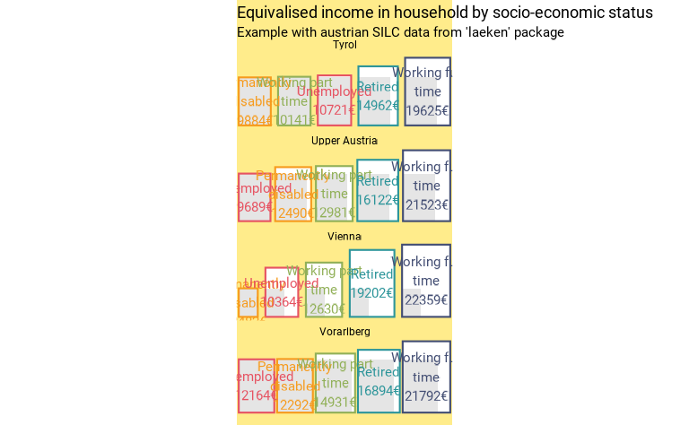

# Fonctions esthétiques

`fonctionr` dispose de quelques fonctions purement graphiques. Leur
objectif est soit d’uniformiser les graphiques pour une publication,
soit de produire des graphiques originaux à partir de résultats déjà
calculés. Ces fonctions ne sont pas toutes très élaborées mais peuvent
s’avérer utiles. Nous les décrivons sur cette page.

``` r
library(fonctionr)
library(patchwork)
library(ggplot2)
library(dplyr)
library(srvyr)
```

## `theme_fonctionr()` & `load_and_active_fonts()`

[`theme_fonctionr()`](https://jgires.github.io/fonctionr/reference/theme_fonctionr.md)
est une fonction qui permet d’appliquer le thème de `fonctionr` à un
objet `ggplot2`. Cette fonction a un intérêt si l’on veut uniformiser
l’esthétique de tous les graphiques pour une publication - ceux qui sont
produits avec `fonctionr` et ceux qui ne le sont pas. L’argument `font`
permet d’indiquer la police d’écriture à utiliser : une police
disponible sur votre système ou une de celles directement contenues dans
`fonctionr`. La fonction
[`load_and_active_fonts()`](https://jgires.github.io/fonctionr/reference/load_and_active_fonts.md)
est automatiquement exécutée lorsque
[`theme_fonctionr()`](https://jgires.github.io/fonctionr/reference/theme_fonctionr.md) est
appliqué : celle-ci a pour but de rendre disponibles les polices
incluses dans le package. Cette fonction est par ailleurs autonome et
permet de charger facilement les polices d’écriture contenues dans
`fonctionr` afin de les rendre disponibles pour n’importe quelle
utilisation avec `ggplot2`. Voir la documentation de la fonction pour
connaître les polices incluses dans le package.

``` r
# Loading of data
data(eusilc, package = "laeken")

tab1 <- eusilc |>
  as_survey_design(ids = db030, strata = db040, weights = rb050) |>
  group_by(pb220a) |>
  summarise(
    prop = survey_mean(eqIncome > 10000, proportion = T, vartype = "ci", na.rm = T)
  )

ggtab1 <- tab1 |>
  ggplot(aes(x = pb220a, y = prop)) +
  geom_col() +
  labs(title = "I'm a graphic") +
  coord_flip()

ggtab2 <- ggtab1 +
  theme_fonctionr(font = "Montserrat")

ggtab1 | ggtab2
```


## `esth_graph()`

[`esth_graph()`](https://jgires.github.io/fonctionr/reference/esth_graph.md)
est une fonction qui permet de construire facilement une graphique
similaire à ceux produit par les autres fonction mais directement à
partir d’une tableau de résultats calculé antérieurement. Cette fonction
a un intérêt si l’on veut appliquer l’esthétique graphique de
`fonctionr` mais à des indicateurs qui ne sont pas calculés par une
fonction de `fonctionr`.
[`esth_graph()`](https://jgires.github.io/fonctionr/reference/esth_graph.md)
permet aisément d’intégrer plusieurs éléments que l’on retrouve dans
d’autres graphiques produits par `fonctionr` : valeurs de l’indicateur,
bornes d’intervalle de confiance, nombres d’individus dans
l’échantillon. La logique
d’[`esth_graph()`](https://jgires.github.io/fonctionr/reference/esth_graph.md)
est différente de celle de
[`theme_fonctionr()`](https://jgires.github.io/fonctionr/reference/theme_fonctionr.md)
: la première fonction produit un graphique à partir d’une table, alors
que la seconde applique un thème à un graphique existant.

En comparaison des autres fonctions,
[`esth_graph()`](https://jgires.github.io/fonctionr/reference/esth_graph.md)
n’a pas d’argument `data`, mais un argument `tab` qui doit correspondre
à la table avec les indicateurs (il s’appelle `tab` car il doit être
similaire à l’objet `tab` produit par la plupart des fonctions de
`fonctionr`). Les arguments `var` et `value` sont obligatoires et ils
indiquent respectivement les colonnes dans `tab` avec nom de
l’indicateur et sa valeur. `reorder` et `show_value`. `error_low`,
`error_upp` et `n_var` permettent d’indiquer les colonnes dans `tab` où
se trouvent les bornes inférieures et supérieures des barres d’erreurs
et le nombre de personnes dans l’échantillon. Par défaut, ces arguments
ont une valeur `NULL`, ce qui conduit à ne pas montrer ces éléments dans
le graphique. `name_total` permet d’indiquer le nom du total dans `tab`
de manière à ce que cette valeur soit mise en évidence (couleur et
position) dans le graphique.

``` r
tab2 <- eusilc |>
  as_survey_design(ids = db030, strata = db040, weights = rb050) |>
  group_by(db040) |>
  cascade(
    mean = survey_mean(eqIncome, vartype = "ci"),
    n = unweighted(n()),
    .fill = "Total"
  )

esth_graph(tab2,
  value = mean,
  var = db040,
  error_low = mean_low,
  error_upp = mean_upp,
  n_var = n,
  name_total = "Total",
  reorder = T,
  digits = 1,
  unit = "€"
)
```


## `make_surface()`

[`make_surface()`](https://jgires.github.io/fonctionr/reference/make_surface.md)
permet de créer la représentation de différentes valeurs déjà calculées
en tant que surfaces - sous la forme de rectangles. Il s’agit d’un
graphique potentiellement intéressant si l’on veut représenter des
surfaces, par exemple la taille des logements en m². La fonction est
purement graphique ; elle s’applique sur un dataframe de plusieurs
lignes comprenant les modalités/groupes à comparer (argument `var`) et
la valeur pour chacun d’eux (`value`). La fonction est donc idéalement
applicable au dataframe `tab` produit par
[`central_group()`](https://jgires.github.io/fonctionr/reference/central_group.md).
Notre package `fonctionr` étant destiné à l’analyse inférentielle, les
bornes supérieures et inférieures des intervalles de confiance peuvent
être indiquées (`error_low` et `error_upp`) ; elles sont alors affichées
sur le graphique d’une manière originale, comme carrés en pointillés
autour de la valeur dans l’échantillon (`show_ci = FALSE` pour les
désactiver). L’ordonnancement des modalités selon la valeur est possible
avec l’argument `reorder = TRUE`.

``` r
eusilc$pl030_rec <- NA
eusilc$pl030_rec[eusilc$pl030 == "1"] <- "Working full time"
eusilc$pl030_rec[eusilc$pl030 == "2"] <- "Working part time"
eusilc$pl030_rec[eusilc$pl030 == "3"] <- "Unemployed"
eusilc$pl030_rec[eusilc$pl030 == "4"] <- "Student"
eusilc$pl030_rec[eusilc$pl030 == "5"] <- "Retired"
eusilc$pl030_rec[eusilc$pl030 == "6"] <- "Permanently disabled"
eusilc$pl030_rec[eusilc$pl030 == "7"] <- "Fulfilling domestic tasks"

eusilc_mean <- mean_group(
  eusilc,
  group = pl030_rec,
  quanti_exp = py010n + py050n + py090n + py100n + py110n + py120n + py130n + py140n,
  filter_exp = !pl030_rec %in% c("Student", "Fulfilling domestic tasks") & db040 == "Tyrol",
  weights = rb050
)
```

``` r
eusilc_mean$tab |> 
  make_surface(
    var = pl030_rec,
    value = mean,
    error_low = mean_low,
    error_upp = mean_upp,
    reorder = T,
    wrap_width_lab = 15,
    unit = "€",
    title = "Equivalised income in household by socio-economic status",
    subtitle = "Example with austrian SILC data from 'laeken' package"
  )
```


La fonction dispose de plusieurs options graphiques. Elle peut afficher
des facettes en renseignant la variable dans l’argument `facet` (le
dataframe doit être [au format
tidy](https://r4ds.had.co.nz/tidy-data.html)). Le réordonnancement des
modalités fonctionne également avec des facettes : dans ce cas, les
couleurs des carrés permettent de facilement repérer l’ordre différent
par modalité de facette ; on peut indiquer dans `pal` n’importe quelle
des palettes de couleur des packages `MetBrewer`ou `PrettyCols` , des
palettes internes à fonctionr ou un vecteur de couleur de base R ou de
codes hexadécimaux. Si l’utilisateur souhaite un graphique monochrome,
il peut utiliser l’argument `col`. L’argument `compare = TRUE` permet
d’afficher la surface la plus petite en surimposition de chaque carré
(par modalité de facette le cas échéant), pour facilement visualiser les
écarts entre les groupes. L’argument `position` permet de régler
l’alignement des surfaces au centre ou en bas (`"mid"` ou `"bottom"`).
L’argument `bg` (qui signifie *background*) permet de définir la couleur
du fond.

``` r
eusilc_mean_region <- mean_group(
  eusilc,
  group = pl030_rec,
  facet = db040,
  quanti_exp = py010n + py050n + py090n + py100n + py110n + py120n + py130n + py140n,
  filter_exp = !pl030_rec %in% c("Student", "Fulfilling domestic tasks") & db040 %in% c("Tyrol", "Upper Austria", "Vienna", "Vorarlberg"),
  weights = rb050
)
```

``` r
eusilc_mean_region$tab |> 
  make_surface(
    var = pl030_rec,
    facet = db040,
    value = mean,
    error_low = mean_low,
    error_upp = mean_upp,
    reorder = T,
    show_ci = F,    
    compare = T,
    bg = "lightgoldenrod1",
    position = "bottom",
    wrap_width_lab = 15,
    unit = "€",
    pal = "Lively",
    title = "Equivalised income in household by socio-economic status",
    subtitle = "Example with austrian SILC data from 'laeken' package"
  )
```


