# Manuel d'utilisation

L’objectif de `fonctionr` est de faciliter l’analyse de données issues
de sondages complexes, dont la manipulation est parfois laborieuse.
`fonctionr` a été développé dans l’idée de réduire la taille du code à
écrire pour produire les résultats descriptifs et d’analyses bivariées
les plus courants.

Le package a également été construit pour pouvoir utiliser directement
les résultats produits dans un rapport. Ainsi, `fonctionr` produit en
une seule fonction : un tableau de résultats avec les indicateurs
voulus, les effectifs et leurs intervalles de confiance ; un graphique
prêt à être publié et le plus souvent un test statistique le plus
approprié aux variables étudiées. Il est aussi possible de directement
exporter ces trois résultats dans un fichier Excel.

Ce guide se structure de la manière suivante. Dans un premier temps on
décrit les différentes fonctions, ce qu’elles produisent et dans quels
cas elles peuvent être utilisées. Dans un deuxième temps, on présente un
tableau récapitulatif des arguments. De nombreux arguments revenant dans
plusieurs fonctions, il est plus facile de présenter la structure
globale de ceux-ci que de se répéter pour chaque fonction.

## Présentation des différentes fonctions

La plupart des fonctions de `fonctionr` permettent, à partir de données
issues d’un sondage (complexe mais aussi simple), de produire une liste
qui contient la plupart du temps ces trois éléments :

- Un graphique qui permet la visualisation des indicateurs calculés avec
  leurs intervalles de confiance. Il s’agit d’un objet `ggplot2` qui
  peut donc être modifié par la suite. Ce graphique est suffisamment
  finalisé pour être directement utilisable dans une publication ;

- Un ou plusieurs dataframe qui reprennent les chiffres sur base
  desquels le graphique est construit. Ceux-ci reprennent généralement
  le nom de l’indicateur, sa valeur, les bornes d’intervalle de
  confiance, le nombre de personnes dans l’échantillon dans chaque
  catégorie, l’estimation du nombre de personnes dans la population dans
  chaque catégorie et les bornes de l’intervalle de confiance de cette
  estimation ;

- Les différents résultats d’un test statistique lorsqu’il y en a un qui
  est pertinent.

La plupart des fonctions permettent aussi d’exporter directement ces
trois résultats dans un format Excel, dans l’idée de pouvoir facilement
communiquer les résultats à une tierce personne, ou à un graphiste dans
le cas du travail de mise en page d’un rapport.

Dans la suite de cette partie, nous passons les fonctions en revue en
indiquant quels sont leurs objectifs et spécificités.

### `distrib_discrete()` : distribution d’une variable catégorielle

[`distrib_discrete()`](https://jgires.github.io/fonctionr/reference/distrib_discrete.md),
avec
[`distrib_d()`](https://jgires.github.io/fonctionr/reference/distrib_discrete.md)
comme alias, calcule la distribution (en proportions relatives) des
différentes modalités d’une variables qualitative. Pour l’exemple, nous
utilisons la base de données anonymisée de l’enquête SILC menée en
Autriche en 2006, contenue dans le package `laeken`. Nous chargeons
d’abord les données et recodons le statut socio-économiques (`pl030`)
pour lui donner des labels intelligibles, utilisés dans la suite des
exemples :

``` r
library(fonctionr)
library(patchwork)

# Loading of data
data(eusilc, package = "laeken")

# Recoding eusilc$pl030 into eusilc$pl030_rec
eusilc$pl030_rec <- NA
eusilc$pl030_rec[eusilc$pl030 == "1"] <- "Working full time"
eusilc$pl030_rec[eusilc$pl030 == "2"] <- "Working part time"
eusilc$pl030_rec[eusilc$pl030 == "3"] <- "Unemployed"
eusilc$pl030_rec[eusilc$pl030 == "4"] <- "Student"
eusilc$pl030_rec[eusilc$pl030 == "5"] <- "Retired"
eusilc$pl030_rec[eusilc$pl030 == "6"] <- "Permanently disabled"
eusilc$pl030_rec[eusilc$pl030 == "7"] <- "Fulfilling domestic tasks"
```

Ci-dessous, la fonction
[`distrib_d()`](https://jgires.github.io/fonctionr/reference/distrib_discrete.md)
décrit la distribution des différents statuts socio-économiques dans le
dataframe `eusilc`, en utilisant la variable de pondération
`rb050`[¹](#fn1). Comme on le voit, les variables sont indiquées sans
mentionner le dataframe (`var` au lieu de `df$var`) et sans guillemets,
à la manière de la syntaxe du `tidyverse`.

``` r
# Computation, taking sample design into account
eusilc_dist_d <- distrib_d(
  data = eusilc,
  quali_var = pl030_rec,
  weights = rb050,
  probs = c(.2, .15, .1, .1, .25, .1, .1),
  title = "Distribution of socio-economic status",
  subtitle = "Example with austrian SILC data from 'laeken' package"
)
```

Nous affichons ensuite le graphique contenu dans la liste produite :

``` r
eusilc_dist_d$graph
```


La liste contient également un dataframe `tab` qui reprend les chiffres
sur base desquels le graphique est construit. Il comprend les colonnes
suivantes : le nom de la modalité (`pl030_rec`), l’estimation de la
proportion de la population appartenant à la modalité (`prop`), les
bornes inférieure (`prop_low`) et supérieure (`prop_upp`) de
l’intervalle de confiance de cette estimation à un niveau de confiance
de 95%, le nombre de personnes dans l’échantillon appartenant à la
modalité (`n_sample`), l’estimation du nombre de personnes dans la
population appartenant à la modalité (`n_weighted`), et les bornes
inférieure (`n_weighted_low`) et supérieure (`n_weighted_upp`) de
l’intervalle de confiance de cette estimation à un niveau de confiance
de 95% :

``` r
eusilc_dist_d$tab
#> # A tibble: 7 × 8
#>   pl030_rec            prop prop_low prop_upp n_sample n_weighted n_weighted_low
#>   <fct>               <dbl>    <dbl>    <dbl>    <int>      <dbl>          <dbl>
#> 1 Fulfilling domest… 0.0948   0.0897   0.100      1207    640311.        605407.
#> 2 Permanently disab… 0.0155   0.0133   0.0180      178    104930.         89217.
#> 3 Retired            0.267    0.259    0.276      3146   1806954.       1750021.
#> 4 Student            0.0586   0.0545   0.0629      736    395829.        367611.
#> 5 Unemployed         0.0449   0.0411   0.0489      518    303252.        277166.
#> 6 Working full time  0.425    0.416    0.434      5162   2869868.       2805298.
#> 7 Working part time  0.0941   0.0890   0.0995     1160    636121.        600495.
#> # ℹ 1 more variable: n_weighted_upp <dbl>
```

La liste contient pour finir le résultat du test statistique dans
l’objet `test.stat`. Dans ce cas, il s’agit du khi2 d’adéquation. Ce
test est réalisé avec comme hypothèse nulle la répartition de la
population selon le vecteur mentionné dans l’argument
`probs = c(.2, .15, .1, .1, .25, .1, .1)`, c’est-à-dire 20% de
travailleurs à temps plein, 15% de travailleurs à temps partiel, 10% de
chômeurs, 10% d’étudiants, 25% de pensionnés, 10% de personnes en
incapacité permanente de travail et 10% de personnes au foyer. Si aucun
vecteur n’avait été mentionné dans `probs`, aucun test n’aurait été
effectué. Si le vecteur n’a pas une somme de 1, il est ajusté pour avoir
une telle somme. Notons que la p-valeur du test est mentionnée sur le
graphique.

``` r
eusilc_dist_d$test.stat
#> 
#>  Design-based chi-squared test for given probabilities
#> 
#> data:  ~pl030_rec
#> X-squared = 11462652, scale = 1300.5577, df = 2.9068, p-value < 2.2e-16
```

### `distrib_group_discrete()` : distribution d’une variable catégorielle par groupe

[`distrib_group_discrete()`](https://jgires.github.io/fonctionr/reference/distrib_group_discrete.md),
avec
[`distrib_group_d()`](https://jgires.github.io/fonctionr/reference/distrib_group_discrete.md)
comme alias, calcule la distribution (en pourcentages) des différentes
modalités d’une variables qualitative selon les modalités d’une autre
variable qualitative, que l’on peut considérer comme des groupes. Par
rapport aux autres fonctions, faute de représentation adéquate, les
intervalles de confiance ne sont pas indiqués sur le graphique. Le
graphique et le tableau contiennent aussi une modalité `Total` qui
reprend l’estimation de la distribution des différentes modalités pour
l’ensemble de la population de référence. Le test statistique repris est
celui du khi2 de Pearson avec l’ajustement de Rao & Scott. Ce test est
réalisé avec comme hypothèse nulle le fait que les deux variables
qualitatives (d’intérêt et de groupe) soient statistiquement
indépendantes.

L’exemple ci-dessous montre la distribution des fréquences des
différents statuts socio-économiques (`pl030_rec`) selon la nationalité
(`pb220a`).

``` r
eusilc_dist_group_d <- distrib_group_d(
  eusilc,
  weights = rb050,
  group = pb220a,
  quali_var = pl030_rec,
  title = "Distribution of socio-economic status according to nationality",
  subtitle = "Example with austrian SILC data from 'laeken' package"
  )
```

``` r
eusilc_dist_group_d$graph
```


``` r
eusilc_dist_group_d$tab
#> # A tibble: 28 × 9
#>    pb220a pl030_rec    prop prop_low prop_upp n_sample n_weighted n_weighted_low
#>    <fct>  <fct>       <dbl>    <dbl>    <dbl>    <int>      <dbl>          <dbl>
#>  1 AT     Fulfillin… 0.0890  0.0838    0.0944     1036    548489.        516023.
#>  2 AT     Permanent… 0.0119  0.00986   0.0142      125     73270.         60135.
#>  3 AT     Retired    0.285   0.276     0.293      3055   1754654.       1698342.
#>  4 AT     Student    0.0602  0.0559    0.0648      693    371222.        343916.
#>  5 AT     Unemployed 0.0388  0.0351    0.0427      411    238841.        215672.
#>  6 AT     Working f… 0.421   0.412     0.431      4689   2595137.       2532480.
#>  7 AT     Working p… 0.0942  0.0888    0.0998     1064    580514.        546451.
#>  8 EU     Fulfillin… 0.124   0.0887    0.166        38     20343.         13851.
#>  9 EU     Permanent… 0.0498  0.0280    0.0811       15      8186.          4019.
#> 10 EU     Retired    0.155   0.115     0.202        45     25429.         17928.
#> # ℹ 18 more rows
#> # ℹ 1 more variable: n_weighted_upp <dbl>
```

``` r
eusilc_dist_group_d$test.stat
#> 
#>  Pearson's X^2: Rao & Scott adjustment
#> 
#> data:  NextMethod()
#> F = 32.8, ndf = 11.957, ddf = 144750.034, p-value < 2.2e-16
```

### `prop_group()` : proportion par groupe

[`prop_group()`](https://jgires.github.io/fonctionr/reference/prop_group.md)
calcule des proportions pour les différentes modalités d’une variable
qualitative, que l’on peut considérer comme des groupes. Pour indiquer
la proportion à calculer, l’utilisateur peut indiquer soit une variable
dichotomique, soit directement une expression (sans mentionner le
dataframe et sans guillemet, à la manière du `tidyverse`) à partir de
laquelle la proportion est calculée. L’exemple ci-dessous compare la
proportion d’individus qui bénéficient d’une allocation de chômage
(calculé avec l’expression `py090n > 0`) selon les différents statuts
socio-économiques (`pl030_rec`).

``` r
eusilc_prop <- prop_group(
  eusilc,
  group = pl030_rec,
  prop_exp = py090n > 0,
  weights = rb050,
  title = "% of ind. receiving unemployment benefits in their hh by soc.-eco. stat.",
  subtitle = "Example with austrian SILC data from 'laeken' package"
  )
```

``` r
eusilc_prop$graph
```

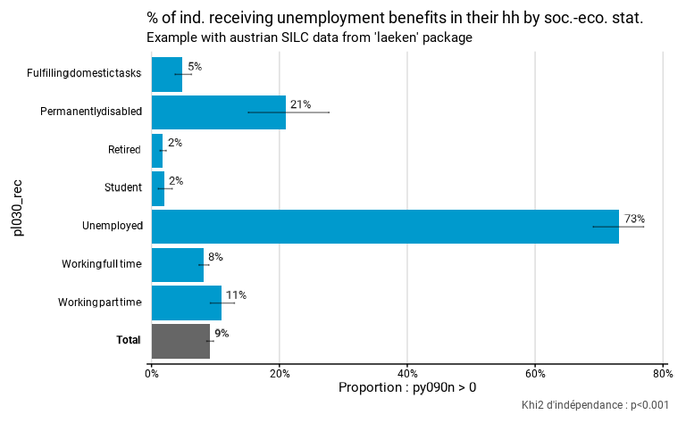

Le graphique et le tableau contiennent aussi une modalité `Total` qui
reprend l’estimation de la proportion pour l’ensemble de la population
de référence. Dans le dataframe `tab` produit, on trouve :

- l’estimation du nombre de personnes dans la population pour lesquelles
  le critère de proportion est vérifié (`n_true_weighted`) accompagné de
  ses bornes inférieure (`n_true_weighted_low`) et supérieure
  (`n_true_weighted_upp`) de l’intervalle de confiance à un niveau de
  confiance de 95% ;
- le nombre total de personnes dans la population pour lesquelles les
  données sont valides[²](#fn2) (`n_tot_weighted`) accompagné de ses
  bornes inférieure (`n_tot_weighted_low`) et supérieure
  (`n_tot_weighted_upp`) de l’intervalle de confiance.

Le test statistique réalisé est celui du khi2 de Pearson avec
l’ajustement de Rao & Scott. Ce test est réalisé avec comme hypothèse
nulle le fait que les deux variables qualitatives (la variable
dichotomique *proportion vraie-fausse* et la variable de groupe) soient
statistiquement indépendantes .

``` r
eusilc_prop$tab
#> # A tibble: 8 × 11
#>   pl030_rec                   prop prop_low prop_upp n_sample n_true_weighted
#>   <fct>                      <dbl>    <dbl>    <dbl>    <int>           <dbl>
#> 1 Fulfilling domestic tasks 0.0485   0.0369   0.0625     1207          31048.
#> 2 Permanently disabled      0.209    0.152    0.278       178          21975.
#> 3 Retired                   0.0177   0.0134   0.0229     3146          31988.
#> 4 Student                   0.0194   0.0106   0.0324      736           7666.
#> 5 Unemployed                0.732    0.691    0.770       518         221878.
#> 6 Working full time         0.0818   0.0743   0.0897     5162         234629.
#> 7 Working part time         0.110    0.0921   0.130      1160          69869.
#> 8 Total                     0.0916   0.0864   0.0970    12107         619054.
#> # ℹ 5 more variables: n_true_weighted_low <dbl>, n_true_weighted_upp <dbl>,
#> #   n_tot_weighted <dbl>, n_tot_weighted_low <dbl>, n_tot_weighted_upp <dbl>
```

``` r
eusilc_prop$test.stat
#> 
#>  Pearson's X^2: Rao & Scott adjustment
#> 
#> data:  NextMethod()
#> F = 485.82, ndf = 5.9943, ddf = 72567.0400, p-value < 2.2e-16
```

La fonction
[`prop_group()`](https://jgires.github.io/fonctionr/reference/prop_group.md)
permet également de différencier le calcul de proportions en différents
sous-groupes au sein des groupes. Par exemple, l’opération ci-dessous
procède au même calcul de la proportion des individus qui bénéficient
d’une allocation de chômage par statut socio-économique, mais en
différenciant les hommes et les femmes au sein de chacun de ces statuts.
La variable de sous-groupe doit être indiquée dans l’argument
`group.fill`. Pour des raisons de lisibilité, il n’y a pas de calcul de
test statistique lorsque des sous-groupes sont définis.

``` r
eusilc_prop_sex <- prop_group(
  eusilc,
  group = pl030_rec,
  prop_exp = py090n > 0,
  group.fill = rb090,
  weights = rb050,
  title = "% of ind. receiving unemp. benefits in their hh by soc.-eco. stat. & sex",
  subtitle = "Example with austrian SILC data from 'laeken' package"
)

eusilc_prop_sex$graph
```


### `central_group()` : valeur centrale (moyenne/médiane) par groupe

[`central_group()`](https://jgires.github.io/fonctionr/reference/central_group.md)
compare la valeur centrale d’une variable quantitative selon les
modalités d’une variable qualitative, que l’on peut considérer comme des
groupes. Deux valeurs centrales sont possibles :

- la moyenne, quand l’argument `type = "mean"` ou pour l’alias
  [`mean_group()`](https://jgires.github.io/fonctionr/reference/central_group.md)
  ;
- la médiane, quand l’argument `type = "median"` ou pour l’alias
  [`median_group()`](https://jgires.github.io/fonctionr/reference/central_group.md).

L’argument `type` est prédéfini pour les fonctions “alias”. Il ne doit
pas être utilisé par l’utilisateur s’il utilise les fonctions “alias”.
Pour indiquer la tendance centrale à calculer, l’utilisateur peut
indiquer soit une variable quantitative, soit directement une expression
(sans mentionner le dataframe et sans guillemet, à la manière du
`tidyverse`) à partir de laquelle une nouvelle variable quantitative est
calculée. L’exemple ci-dessous compare le revenu équivalent mensuel
moyen (calculé avec l’expression `eqIncome / 12`) selon les différents
statuts socio-économiques des personnes (`pl030_rec`). Le graphique et
le tableau contiennent une modalité “Total” qui reprend l’estimation de
tendance centrale pour l’ensemble de la population de référence.

Pour
[`mean_group()`](https://jgires.github.io/fonctionr/reference/central_group.md),
le test statistique effectué est un test de Wald, qui est un test
équivalent à une analyse de variance (ANOVA) mais pour des données
issues d’un sondage complex[³](#fn3). Ce test est réalisé avec comme
hypothèse nulle le fait que les coefficients d’une régression linéaire
pour les modalités de la variable qualitative (les groupes) sur la
variable quantitative soient nuls. Pour
[`median_group()`](https://jgires.github.io/fonctionr/reference/central_group.md),
le test statistique effectué est celui de Kruskal Wallis.

``` r
eusilc_mean <- mean_group(
  eusilc,
  group = pl030_rec,
  quanti_exp = eqIncome / 12,
  weights = rb050,
  title = "Mean of monthly equivalised income in household by socio-economic status",
  subtitle = "Example with austrian SILC data from 'laeken' package"
)
```

``` r
eusilc_mean$graph
```


``` r
eusilc_mean$tab
#> # A tibble: 8 × 8
#>   pl030_rec            mean mean_low mean_upp n_sample n_weighted n_weighted_low
#>   <fct>               <dbl>    <dbl>    <dbl>    <int>      <dbl>          <dbl>
#> 1 Fulfilling domesti… 1296.    1255.    1337.     1207    640311.        605407.
#> 2 Permanently disabl… 1330.    1206.    1454.      178    104930.         89217.
#> 3 Retired             1720.    1688.    1751.     3146   1806954.       1750021.
#> 4 Student             1355.    1296.    1414.      736    395829.        367611.
#> 5 Unemployed          1456.    1382.    1531.      518    303252.        277166.
#> 6 Working full time   1895.    1870.    1920.     5162   2869868.       2805298.
#> 7 Working part time   1591.    1545.    1637.     1160    636121.        600495.
#> 8 Total               1703.    1686.    1719.    12107   6757264.       6702060.
#> # ℹ 1 more variable: n_weighted_upp <dbl>
```

``` r
eusilc_mean$test.stat
#> Wald test for pl030_rec
#>  in svyglm(formula = fmla, design = data_W)
#> F =  137.4607  on  6  and  12100  df: p= < 2.22e-16
```

### `many_val()` : calculer plusieurs indicateurs

[`many_val()`](https://jgires.github.io/fonctionr/reference/many_val.md)
réalise des calculs de proportion ou de tendance centrale simultanément
pour plusieurs variables différentes. La fonction permet de calculer
trois résultats différents :

- Le calcul de proportions quand l’argument `type = "prop"` ou pour
  l’alias
  [`many_prop()`](https://jgires.github.io/fonctionr/reference/many_val.md)
  ;
- Le calcul de moyennes quand l’argument `type = "mean"` ou pour l’alias
  [`many_mean()`](https://jgires.github.io/fonctionr/reference/many_val.md)
  ;
- Le calcul de médianes quand l’argument `type = "median"` ou pour
  l’alias
  [`many_median()`](https://jgires.github.io/fonctionr/reference/many_val.md).

L’argument `type` est prédéfini pour les fonctions “alias”. Il ne doit
pas être utilisé par l’utilisateur s’il utilise les fonctions “alias”.
Les variables pour lesquelles on veut réaliser ce calcul sont indiquées
sans guillemets dans un vecteur passé à l’argument `list_vars`.
Contrairement à
[`prop_group()`](https://jgires.github.io/fonctionr/reference/prop_group.md)
ou
[`central_group()`](https://jgires.github.io/fonctionr/reference/central_group.md),
on ne peut pas indiquer d’expression : ce doit être des variables
dichotomisées (pour les proportions) ou quantitatives (pour les moyennes
ou médianes). Le dataframe `tab` produit, contenant les indicateurs, est
analogue à celui produit par
[`prop_group()`](https://jgires.github.io/fonctionr/reference/prop_group.md)
pour les proportions et
[`central_group()`](https://jgires.github.io/fonctionr/reference/central_group.md)
pour les moyennes/médianes. Pour des raisons de lisibilité, ces
fonctions ne calculent aucun test statistique.

L’exemple ci-dessous compare les revenus mensuels moyens de l’emploi
salarié, d’une activité d’indépendant et d’une allocation de chômage
dans la totalité de la population.

``` r
# Computation, taking sample design into account
eusilc_many_mean <- many_mean(
  eusilc,
  list_vars = c(py010n, py050n, py090n),
  list_vars_lab = c("salaires", "revenus d'une activité indépendant", "allocation de chômage"),
  weights = rb050,
  unit = "€",
  title = "Income from wage, independant worker and unemployement benefits",
  subtitle = "Example with austrian SILC data from 'laeken' package"
)
```

``` r
eusilc_many_mean$graph
```

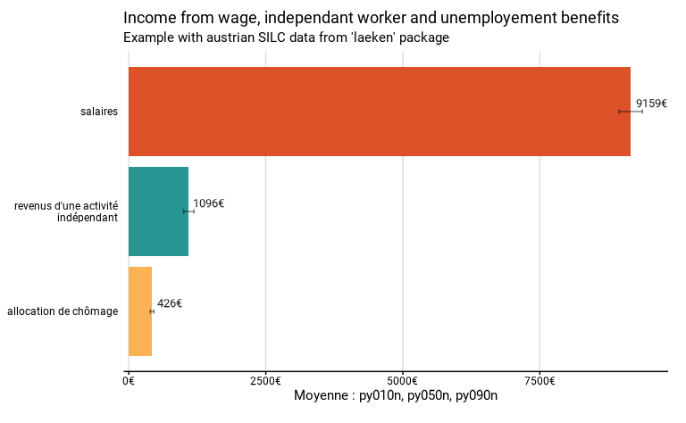

``` r
eusilc_many_mean$tab
#> # A tibble: 3 × 8
#>   list_col             mean mean_low mean_upp n_sample n_weighted n_weighted_low
#>   <fct>               <dbl>    <dbl>    <dbl>    <int>      <dbl>          <dbl>
#> 1 salaires            9159.    8945.    9373.    12107   6757264.       6702061.
#> 2 revenus d'une acti… 1096.    1002.    1191.    12107   6757264.       6702061.
#> 3 allocation de chôm…  426.     393.     459.    12107   6757264.       6702061.
#> # ℹ 1 more variable: n_weighted_upp <dbl>
```

### `many_val_group()` : calculer plusieurs indicateurs par groupe

[`many_val_group()`](https://jgires.github.io/fonctionr/reference/many_val_group.md)
fonctionne comme
[`many_val()`](https://jgires.github.io/fonctionr/reference/many_val.md),
mais permet d’indiquer une variable qualitative de groupes : les
résultats sont alors différenciés selon les différentes modalités de
cette variable (= les groupes). Ici aussi, aucun test statistique n’est
effectué. Trois calculs sont possibles :

- La comparaison de proportions quand l’argument `type = "prop"` ou pour
  l’alias
  [`many_prop_group()`](https://jgires.github.io/fonctionr/reference/many_val_group.md)
  ;
- La comparaison de moyennes quand l’argument `type = "mean"` ou pour
  l’alias
  [`many_mean_group()`](https://jgires.github.io/fonctionr/reference/many_val_group.md)
  ;
- La comparaison de médianes quand l’argument `type = "median"` ou pour
  l’alias
  [`many_median_group()`](https://jgires.github.io/fonctionr/reference/many_val_group.md).

L’argument `type` est prédéfini pour les fonctions “alias”. Il ne doit
pas être utilisé par l’utilisateur s’il utilise les fonctions “alias”.
L’exemple ci-dessous compare les revenus mensuels moyens de l’emploi
salarié, d’une activité d’indépendant et d’une allocation de chômage des
femmes et des hommes.

``` r
# Computation, taking sample design into account
eusilc_many_mean_group <- many_mean_group(
  eusilc,
  group = rb090,
  list_vars = c(py010n, py050n, py090n),
  list_vars_lab = c("salaires", "revenus d'une activité indépendant", "allocation de chômage"),
  weights = rb050,
  unit = "€",
  title = "Income from wage, independant worker and unemployement benefits by sex",
  subtitle = "Example with austrian SILC data from 'laeken' package"
)
```

``` r
eusilc_many_mean_group$graph
```


``` r
eusilc_many_mean_group$tab
#> # A tibble: 9 × 9
#>   rb090  list_col      mean mean_low mean_upp n_sample n_weighted n_weighted_low
#>   <fct>  <fct>        <dbl>    <dbl>    <dbl>    <int>      <dbl>          <dbl>
#> 1 male   salaires    12445.   12098.   12791.     5844   3237897.       3171916.
#> 2 female salaires     6136.    5900.    6372.     6263   3519368.       3451545.
#> 3 Total  salaires     9159.    8945.    9373.    12107   6757264.       6702061.
#> 4 male   revenus d'…  1539.    1368.    1711.     5844   3237897.       3171916.
#> 5 female revenus d'…   689.     600.     778.     6263   3519368.       3451545.
#> 6 Total  revenus d'…  1096.    1002.    1191.    12107   6757264.       6702061.
#> 7 male   allocation…   420.     371.     468.     5844   3237897.       3171916.
#> 8 female allocation…   431.     386.     476.     6263   3519368.       3451545.
#> 9 Total  allocation…   426.     393.     459.    12107   6757264.       6702061.
#> # ℹ 1 more variable: n_weighted_upp <dbl>
```

### `distrib_continuous()` : distribution d’une variable continue

[`distrib_continuous()`](https://jgires.github.io/fonctionr/reference/distrib_continuous.md),
avec
[`distrib_c()`](https://jgires.github.io/fonctionr/reference/distrib_continuous.md)
comme alias, calcule la distribution d’une variable continue. L’argument
`type` permet d’indiquer quel type de valeur centrale doit être calculée
et indiquée sur le graphique : `"mean"` pour la moyenne et `"median"`
pour la médiane. Par défaut, c’est la médiane qui est calculée et
affichée. `bw` indique le degré de “lissage” de la densité. Une valeur
plus élevée conduira à davantage lisser la densité et masquera davantage
les variations locales. `resolution` indique la “finesse” du calcul de
la densité. Avec une résolution plus faible, il y aura moins de points
et on verra graphiquement les petites droites reliant les points de
densité. Une grande résolution implique cependant des calculs plus
longs.

L’exemple ci-dessous décrit la distribution de l’âge. L’objet produit
est une liste qui comprend quatre éléments. On trouve `graph` et `tab`,
comme dans les autres fonction.

``` r
distrib_age <- distrib_c(eusilc, age, type = "mean", bw = .7)
```

``` r
distrib_age$graph
```


``` r
distrib_age$tab
#> # A tibble: 1 × 7
#>    mean mean_low mean_upp n_sample n_weighted n_weighted_low n_weighted_upp
#>   <dbl>    <dbl>    <dbl>    <int>      <dbl>          <dbl>          <dbl>
#> 1  39.2     38.8     39.6    14827      14827          14827          14827
```

L’objet `dens` reprend la densité calculée, et l’objet `quant` reprend
les différents quantiles retenus. Dans cette fonction, il n’y a, pour le
moment, pas de test statistique calculé .

``` r
head(distrib_age$dens)
#>           x            y quantFct central
#> 1 -7.182919 1.471091e-05        1    <NA>
#> 2 -7.075034 1.736570e-05        1    <NA>
#> 3 -6.967150 2.043762e-05        1    <NA>
#> 4 -6.859265 2.398120e-05        1    <NA>
#> 5 -6.751381 2.808797e-05        1    <NA>
#> 6 -6.643496 3.289015e-05        1    <NA>
```

``` r
distrib_age$quant
#>   probs quantile ci.2.5 ci.97.5
#> 1   0.1        9      9      10
#> 2   0.2       17     17      18
#> 3   0.3       25     25      26
#> 4   0.4       33     33      34
#> 5   0.5       39     39      40
#> 6   0.6       45     45      46
#> 7   0.7       52     52      53
#> 8   0.8       60     60      61
#> 9   0.9       70     70      71
```

### `distrib_group_continuous()` : distribution d’une variable continue par groupe

[`distrib_group_continuous()`](https://jgires.github.io/fonctionr/reference/distrib_group_continuous.md),
avec
[`distrib_group_c()`](https://jgires.github.io/fonctionr/reference/distrib_group_continuous.md)
comme alias, calcule la distribution d’une variables continue selon les
modalités d’une variable qualitative, que l’on peut considérer comme des
groupes. Comme pour `distrib_continous()`, la fonction produit une liste
contenant un graphique (`graph`), une densité (`dens`), une table
(`tab`), les quantiles retenus (`quant`). On trouve aussi une boite à
moustache (`moustache`) qui indique les bornes dans lesquelles on trouve
différentes proportions de la population autour de la médiane (par
défaut : 50%, 75% et 95% - les proportions peuvent être paramétrées dans
l’argument `moustache_probs`). Un test statistique est aussi implémenté.
Comme pour
[`central_group()`](https://jgires.github.io/fonctionr/reference/central_group.md),
si l’utilisateur choisi de calculer la médiane (le choix par défaut), le
test statistique effectué est celui de Kruskal Wallis ; s’il ou elle
choisi de calculer la moyenne, test statistique effectué est un test de
Wald. Les test effectués sont les mêmes que pour
[`central_group()`](https://jgires.github.io/fonctionr/reference/central_group.md).

L’exemple ci-dessous compare la distribution des revenus équivalents
selon le statut socio-économique. Comme pour
[`central_group()`](https://jgires.github.io/fonctionr/reference/central_group.md),
il est possible d’utiliser une expression quantitative au lieu d’une
variable. Ici, c’est le revenu équivalent annuel divisé par 12 qui est
retenu pour qu’il soit exprimé en montant mensuel.

``` r
distrib_income <- distrib_group_c(
  eusilc,
  pl030_rec,
  eqIncome / 12,
  type = "mean",
  limits = c(0, 4100),
  bw = .7
)
```

``` r
distrib_income$graph
```

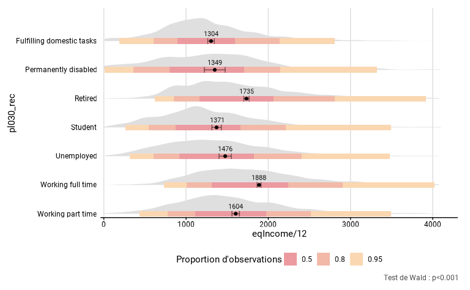

``` r
distrib_income$tab
#> # A tibble: 7 × 8
#>   pl030_rec            mean mean_low mean_upp n_sample n_weighted n_weighted_low
#>   <chr>               <dbl>    <dbl>    <dbl>    <int>      <dbl>          <dbl>
#> 1 Fulfilling domesti… 1304.    1264.    1344.     1207       1207          1142.
#> 2 Permanently disabl… 1349.    1222.    1476.      178        178           152.
#> 3 Retired             1735.    1703.    1767.     3146       3146          3048.
#> 4 Student             1371.    1314.    1429.      736        736           684.
#> 5 Unemployed          1476.    1401.    1551.      518        518           474.
#> 6 Working full time   1888.    1864.    1912.     5162       5162          5048.
#> 7 Working part time   1604.    1558.    1650.     1160       1160          1096.
#> # ℹ 1 more variable: n_weighted_upp <dbl>
```

``` r
head(distrib_income$dens)
#>               group         x            y quantFct     y_ridges central
#> 1 Working part time -283.5941 6.994595e-08        1 6.614026e-05    <NA>
#> 2 Working part time -266.6236 1.182238e-07        1 1.117914e-04    <NA>
#> 3 Working part time -249.6530 1.942940e-07        1 1.837227e-04    <NA>
#> 4 Working part time -232.6824 3.107223e-07        1 2.938162e-04    <NA>
#> 5 Working part time -215.7118 4.839372e-07        1 4.576066e-04    <NA>
#> 6 Working part time -198.7413 7.454306e-07        1 7.048725e-04    <NA>
```

``` r
head(distrib_income$quant)
#>               group probs quantile    ci.2.5   ci.97.5
#> 1 Working part time   0.1  774.170  729.3306  823.6833
#> 2 Working part time   0.2 1016.212  978.0693 1057.4755
#> 3 Working part time   0.3 1186.148 1148.6437 1235.4963
#> 4 Working part time   0.4 1339.096 1292.6704 1375.1817
#> 5 Working part time   0.5 1476.866 1435.1671 1534.5294
#> 6 Working part time   0.6 1642.664 1595.5897 1686.8407
```

``` r
head(distrib_income$moustache)
#> # A tibble: 6 × 4
#>   group             moustache_prob xbegin  xend
#>   <chr>             <chr>           <dbl> <dbl>
#> 1 Working part time 0.95             436. 3496.
#> 2 Working part time 0.8              774. 2517.
#> 3 Working part time 0.5             1113. 1974.
#> 4 Working full time 0.95             734. 4019.
#> 5 Working full time 0.8             1008. 2909.
#> 6 Working full time 0.5             1315. 2241.
```

## Arguments des différentes fonctions

### Tableau récapitulatif des arguments

Comme nous l’avons vu, la majorité des fonctions de `fonctionr` se
ressemblent. La plupart des arguments se retrouvent dans plusieurs
fonctions. Le tableau ci-dessous reprend la totalité des arguments en
indiquant chaque fois pour quelle(s) fonction(s) il est utilisé. L’ordre
repris est celui des fonctions et les couleurs regroupent les arguments
selon leur “catégorie”. Cette dernière a une visée pédagogique et
regroupe ensemble des arguments dont le rôle est similaire. Dans la
suite, nous aborderons successivement les arguments liés à la base de
donnée utilisée, les arguments indispensables qui doivent
obligatoirement être mentionnés, les arguments clés – c’est-à-dire pas
obligatoires mais ayant une influence sur les résultats – et les
arguments esthétiques – c’est-à-dire qui n’influencent que le graphique.

| Catégorie d’argument | prop_group | many_val_group | many_val | central_group | distrib_group_c | distrib_c | distrib_group_d | distrib_d |
|:---|:---|:---|:---|:---|:---|:---|:---|:---|
| Base de données | data | data | data | data | data | data | data | data |
| Indispensable | group | group |  | group | group |  | group |  |
| Indispensable | prop_exp |  |  |  |  |  |  |  |
| Indispensable |  |  |  | quanti_exp | quanti_exp | quanti_exp |  |  |
| Indispensable |  |  |  |  |  |  | quali_var | quali_var |
| Indispensable |  | list_vars | list_vars |  |  |  |  |  |
| Indispensable |  | type | type | type | type | type |  |  |
| Esthétique de base |  | list_vars_lab | list_vars_lab |  |  |  |  |  |
| Argument clé | group.fill |  |  | group.fill |  |  |  |  |
| Argument clé | facet | facet | facet | facet |  |  | facet | facet |
| Argument clé | filter_exp | filter_exp | filter_exp | filter_exp | filter_exp | filter_exp | filter_exp | filter_exp |
| Base de données | … | … | … | … | … | … | … | … |
| Argument clé | na.rm.group | na.rm.group |  | na.rm.group | na.rm.group |  | na.rm.group |  |
| Argument clé | na.rm.facet | na.rm.facet | na.rm.facet | na.rm.facet |  |  | na.rm.facet | na.rm.facet |
| Argument clé | na.prop |  |  |  |  |  |  |  |
| Argument clé |  | na.vars | na.vars |  |  |  |  |  |
| Argument clé |  |  |  |  |  |  | na.rm.var | na.rm.var |
| Argument clé |  |  |  |  |  |  |  | probs |
| Argument clé | total | total |  | total |  |  | total |  |
| Argument clé | prop_method | prop_method | prop_method |  |  |  | prop_method | prop_method |
| Argument clé |  |  |  |  | quantiles | quantiles |  |  |
| Argument clé |  |  |  |  | moustache_probs |  |  |  |
| Esthétique de base |  |  |  |  | bw | bw |  |  |
| Esthétique de base |  |  |  |  | resolution | resolution |  |  |
| Esthétique de base |  |  |  |  | height |  |  |  |
| Esthétique de base |  |  |  |  | limits | limits |  |  |
| Esthétique de base | reorder |  | reorder | reorder | reorder |  | reorder | reorder |
| Esthétique de base |  | position |  |  |  |  |  |  |
| Esthétique de base | show_ci | show_ci | show_ci | show_ci |  |  |  | show_ci |
| Esthétique de base |  |  |  |  | show_mid_point |  |  |  |
| Esthétique de base |  |  |  |  | show_mid_line | show_mid_line |  |  |
| Esthétique de base |  |  |  |  | show_ci_errorbar |  |  |  |
| Esthétique de base |  |  |  |  | show_ci_lines | show_ci_lines |  |  |
| Esthétique de base |  |  |  |  | show_ci_area | show_ci_area |  |  |
| Esthétique de base |  |  |  |  | show_quant_lines | show_quant_lines |  |  |
| Esthétique de base |  |  |  |  | show_moustache |  |  |  |
| Esthétique de base | show_n | show_n | show_n | show_n |  | show_n | show_n | show_n |
| Esthétique de base | show_value | show_value | show_value | show_value | show_value | show_value | show_value | show_value |
| Esthétique de base | show_labs | show_labs | show_labs | show_labs | show_labs | show_labs | show_labs | show_labs |
| Esthétique de base | total_name | total_name |  | total_name | total_name |  |  |  |
| Esthétique: chiffres | scale | scale | scale |  |  |  | scale | scale |
| Esthétique: chiffres | digits | digits | digits | digits | digits | digits | digits | digits |
| Esthétique: chiffres | unit | unit | unit | unit | unit | unit | unit | unit |
| Esthétique: chiffres | dec | dec | dec | dec | dec | dec | dec | dec |
| Esthétique: graphique | pal | pal | pal | pal | pal | pal | pal | pal |
| Esthétique: graphique | direction | direction | direction | direction |  |  | direction |  |
| Esthétique: graphique |  |  |  |  | pal_moustache |  |  |  |
| Esthétique: graphique |  |  |  |  | color | color |  |  |
| Esthétique: graphique |  |  |  |  | alpha |  |  |  |
| Esthétique: graphique | dodge | dodge | dodge | dodge |  |  | dodge | dodge |
| Esthétique: lettres | font | font | font | font | font | font | font | font |
| Esthétique: lettres | wrap_width_y | wrap_width_y | wrap_width_y | wrap_width_y | wrap_width_y |  | wrap_width_y | wrap_width_y |
| Esthétique: lettres | wrap_width_leg | wrap_width_leg |  | wrap_width_leg |  |  | wrap_width_leg |  |
| Esthétique: lettres | legend_ncol | legend_ncol |  | legend_ncol |  |  | legend_ncol |  |
| Esthétique: labels | title | title | title | title | title | title | title | title |
| Esthétique: labels | subtitle | subtitle | subtitle | subtitle | subtitle | subtitle | subtitle | subtitle |
| Esthétique: labels | xlab | xlab | xlab | xlab | xlab | xlab | xlab | xlab |
| Esthétique: labels | ylab | ylab | ylab | ylab | ylab | ylab | ylab |  |
| Esthétique: labels | legend_lab | legend_lab |  | legend_lab |  |  | legend_lab |  |
| Esthétique: labels | caption | caption | caption | caption | caption | caption | caption | caption |
| Esthétique: labels | lang | lang | lang | lang | lang | lang | lang | lang |
| Esthétique: graphique | theme | theme | theme | theme | theme | theme | theme | theme |
| Esthétique: graphique | coef_font | coef_font | coef_font | coef_font | coef_font | coef_font | coef_font | coef_font |

### Les arguments liés à la base de données utilisée

`data` est bien entendu un argument fondamental car il indique la base
de donnée à utiliser. Comme l’objectif du package est de permettre une
analyse des sondages complexes, il peut s’agir d’un objet `survey` ou
d’un objet `srvyr`, qui contiennent les différentes informations sur le
plan de sondage (poids, strates, PSU…). Il est possible que l’objet
`survey` ou `srvyr` soit un objet avec avec des *replicate weights* pour
utiliser les méthodes de rééchantillonnage pour estimer la variance
d’échantillonnage.

Il est également possible que `data` soit un dataframe. Dans ce cas, si
aucune autre précision n’est apportée, les fonctions font l’hypothèse
d’un sondage aléatoire simple. Ainsi, `fonctionr` peut être utilisé pour
l’analyse des sondages complexes mais aussi des sondages aléatoires
simples. Mais `fonctionr` peut aussi créer un objet de sondage complexe
à partir d’un dataframe. Les arguments définissant le design de
l’enquête (poids, strates, etc.) doivent alors être indiqués dans
l’argument `…` (dot-dot-dot). Cette manière de procéder fonctionne pour
les sondages complexes classiques mais pas pour les sondages complexes
intégrant des *replicate weights*. Si l’ont veut intégrer des
*replicates weights*, il est nécessaire de créer d’abord un objet
`survey` ou `srvyr` et d’utiliser cet objet dans `fonctionr`.

Les exemples ci-dessous montrent trois manière différentes de prendre en
compte un même plan de sondage : en l’indiquant directement dans la
fonction de `fonctionr`, en créant au préalable un objet `survey` et en
créant au préalable un objet `srvyr`.

``` r
library(survey)
library(srvyr)

# Un exemple où on indique directement dans la fonction de fonctionr les différents éléments du plan de sondage
eusilc_prop_1 <- prop_group(
  eusilc,
  group = pl030_rec,
  prop_exp = py090n > 0,
  strata = db040,
  ids = db030,
  weights = rb050,
  title = "dataframe"
)

# Un exemple où utilise un objet survey
eusilc_survey <- svydesign(id = ~db030, strat = ~db040, weight = ~rb050, data = eusilc)
eusilc_prop_2 <- prop_group(
  eusilc_survey,
  group = pl030_rec,
  prop_exp = py090n > 0,
  title = "survey object",
  ylab = "",
  wrap_width_y = 15
)

# Un exemple où utilise un objet srvyr
eusilc_srvyr <- as_survey_design(eusilc, ids = db030, strata = db040, weights = rb050)
eusilc_prop_3 <- prop_group(
  eusilc_srvyr,
  group = pl030_rec,
  prop_exp = py090n > 0,
  title = "srvyr object",
  ylab = "",
  wrap_width_y = 15
)
```

``` r
eusilc_prop_1$graph | eusilc_prop_2$graph | eusilc_prop_3$graph
```

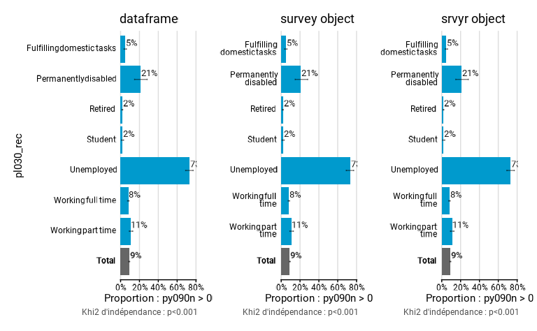

### Les arguments indispensables

Les arguments indispensable sont des arguments qui sont nécessaires au
bon fonctionnement des fonctions et qui ne peuvent prendre aucune valeur
par défaut. Ces arguments sont principalement de différents types :
variables qualitatives, expressions ou listes de variables. Les
variables/colonnes sont toujours indiquées sans mentionner le dataframe
et sans guillemet, à la manière du `tidyverse`.

- `group` et `quali_var` sont des variables qualitatives qui indiquent
  les groupes ou variables qualitative dont on veut calculer la
  distribution. Les variables indiquées pour ces arguments sont
  transformées en facteurs pour leur usage dans la fonction.

- `prop_exp` et `quanti_exp` sont des expressions qui permettent de
  calculer les proportions ou tendances centrales. Dans `fonctionr`,
  tous les arguments pouvant contenir une expression terminent par
  `_exp`. Ces arguments peuvent être des variables (une variable binaire
  0-1 pour `prop_exp` et une variable numérique pour `quanti_exp`) ou
  une expression qui produit une variable (binaire pour `prop_exp` et
  quantitative pour `quanti_exp`). Ainsi, il n’est pas nécessaire de
  préparer à l’avance les variables binaire ou la quantitative, elles
  peuvent être calculées “à la volée”. Précisons que seuls les variables
  de la base de données, les opérateurs et les valeurs numérique sont
  autorisés dans les expressions ; les objets extérieurs (par exemple un
  seuil contenu dans un vecteur stocké dans l’environnement global) ne
  sont pas autorisés. Précisons aussi que par défaut les `NA` sont
  retirés avant le calcul des variables de proportions. C’est pourquoi
  l’utilisation de la fonction
  [`is.na()`](https://rdrr.io/r/base/NA.html) n’est, par défaut, pas
  autorisée dans l’argument `prop_exp`. D’autres fonctions, qui prennent
  en compte les `NA`, par exemple la fonction `%in%`, ne fonctionnent
  pas comme attendues, car ici les `NA` sont exclus des calculs a
  priori. Il est possible de changer cette manière de procéder avec
  l’argument `na.prop`.Plus de détails se trouvent dans le point
  *Traitement des NA*.

- `list_vars` doit être un vecteur reprenant l’ensemble des variables
  reprises dans les fonctions
  [`many_val()`](https://jgires.github.io/fonctionr/reference/many_val.md)
  et
  [`many_val_group()`](https://jgires.github.io/fonctionr/reference/many_val_group.md)
  ainsi que leurs alias. Pour
  [`many_prop()`](https://jgires.github.io/fonctionr/reference/many_val.md)
  et
  [`many_prop_group()`](https://jgires.github.io/fonctionr/reference/many_val_group.md),
  les variables doivent être binaires (il aurait été trop compliqué
  d’introduire ici des expressions) et pour
  [`many_mean()`](https://jgires.github.io/fonctionr/reference/many_val.md),
  [`many_mean_group()`](https://jgires.github.io/fonctionr/reference/many_val_group.md),
  [`many_median()`](https://jgires.github.io/fonctionr/reference/many_val.md)
  et
  [`many_median_group()`](https://jgires.github.io/fonctionr/reference/many_val_group.md),
  les variables doivent être numériques. L’argument `list_vars_lab`
  permet d’indiquer le label pour les variables à l’aide d’un vecteur.
  Bien qu’il ne s’agisse pas d’un argument indispensable, nous l’avons
  placé juste après `list_vars` pour faciliter l’utilisation des
  fonctions. Pour `list_vars_lab`, les guillemets doivent être utilisé
  pour indiquer les labels des variables.

Dans l’exemple ci-dessous, on calcule selon le sexe la proportion des
répondants qui travaillent et dont le salaire net annuel était inférieur
à 12000€. On peut ainsi introduire des expressions complexes dans les
fonctions.

``` r
eusilc_prop_NA_excl <- prop_group(
  eusilc,
  group = rb090,
  prop_exp = (pl030 == "1" | pl030 == "2") & py010n < 12000,
  weights = rb050,
  title = "% of the population that works and whose wage is less than 12000€ net",
  subtitle = "Example with austrian SILC data from 'laeken' package"
)
```

``` r
eusilc_prop_NA_excl$graph
```

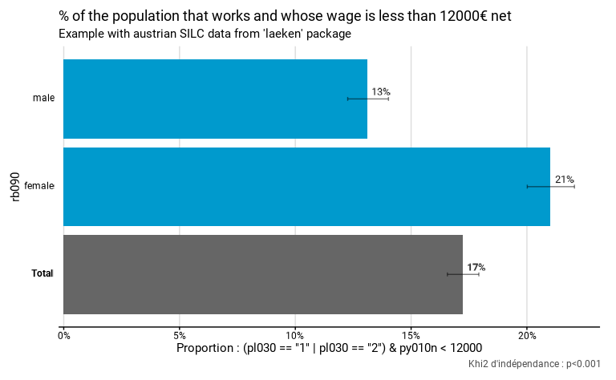

### Les arguments clés : pas obligatoires mais influençant les résultats

Les arguments clés sont des arguments qui ne sont pas indispensables
mais qui influencent les résultats. On y retrouve plusieurs types
d’arguments.

- `group.fill` permet d’indiquer une variable de sous-groupes pour
  différencier les résultats plus finement. Cet argument n’est que
  disponible dans
  [`prop_group()`](https://jgires.github.io/fonctionr/reference/prop_group.md)
  et
  [`central_group()`](https://jgires.github.io/fonctionr/reference/central_group.md).
  Comme `group` et `quali_var`, la variable indiquée pour `group.fill`
  est transformée en facteur pour son usage dans la fonction. Dans
  l’exemple ci-dessous, on compare les revenus moyens par statut
  socio-économique et sexe.

  ``` r
  eusilc_income_status_sex <- mean_group(
    eusilc,
    group = pl030_rec,
    group.fill = rb090,
    quanti_exp = eqIncome/12,
    weights = rb050,
    title = "Mean mensual equivalent income according to status and sex",
    subtitle = "Example with austrian SILC data from 'laeken' package",
    unit = "€"
  )

  eusilc_income_status_sex$graph
  ```

  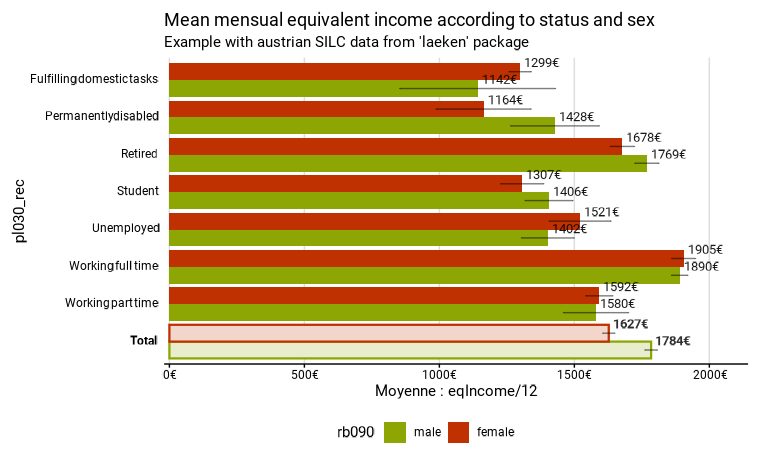

- `facet` permet d’indiquer une variable qualitative pour différencier
  les résultats selon les différentes modalités de cette variable, dans
  le graphique `ggplot2` et le dataframe de résultat `tab`. Dans le
  graphique, elle produit des “facettes”, d’où le nom de l’argument.
  Comme `group`, `group.fill` et `quali_var`, la variable indiquée pour
  cet argument est transformée en facteur pour leur usage dans la
  fonction. Par défaut, les facettes ne sont pas produites. Ci-dessous,
  on calcule la distribution des différents statuts socio-économiques
  par région (indiquée comme variable de facettes) :

``` r
# Computation, taking sample design into account
eusilc_dist_d <- distrib_d(
  data = eusilc,
  quali_var = pl030_rec,
  facet = db040,
  weights = rb050,
  probs = c(.2, .15, .1, .1, .25, .1, .1),
  title = "Distribution of socio-economic status",
  subtitle = "Example with austrian SILC data from 'laeken' package"
)
```

``` r
eusilc_dist_d$graph
```


- `filter_exp` est une expression qui permet de filtrer les données de
  manière à produire les résultats sur une partie de l’échantillon.
  Comme il s’agit d’une expression, il est possible de mettre en oeuvre
  des conditions de filtres complexe et multiple, par exemple
  sélectionner uniquement les personnes âgées de moins de 60 ans, dont
  le revenu mensuel est inférieur à 3000€ et qui sont célibataires. Si
  une possibilité de filtrage est inclue dans les fonctions, c’est pour
  que le filtrage des données soit réalisé après la définition du plan
  de sondage, afin que le filtrage ne modifie pas celui-ci comme le
  recommande Thomas Lumley, l’auteur de `survey`[⁴](#fn4). Ici aussi,
  seules les variables de la base de données, les opérateurs et les
  valeurs numérique sont autorisés dans les expressions.

- `total` est un argument qui permet de calculer l’indicateur ou la
  distribution de la variable pour le total, et pas uniquement pour les
  groupes. Cela permet de comparer non seulement les groupes entre-eux,
  mais aussi à l’ensemble de la population. Cet argument n’est
  disponible que pour
  [`prop_group()`](https://jgires.github.io/fonctionr/reference/prop_group.md),
  [`central_group()`](https://jgires.github.io/fonctionr/reference/central_group.md),
  [`distrib_group_d()`](https://jgires.github.io/fonctionr/reference/distrib_group_discrete.md)
  et
  [`many_val_group()`](https://jgires.github.io/fonctionr/reference/many_val_group.md),
  et leurs alias. Par défaut le total s’affiche (`total = TRUE`). Il
  s’agit d’un argument clé et pas uniquement d’un argument esthétique,
  car la présence du total dans `tab` et dans l’export Excell dépend de
  la valeur prise par cet argument.

- `prop_method` est un argument qui permet de choisir le type de
  correction pour l’estimation des intervalles de confiance d’une
  proportion, notamment pour éviter d’avoir des bornes inférieures à 0
  ou supérieures à 1. Les valeurs peuvent prendre celles mentionnées
  dans l’argument `method` de
  [`svyciprop()`](https://rdrr.io/pkg/survey/man/svyciprop.html) du
  package `survey`[⁵](#fn5). Par défaut, c’est la méthode `"beta"` qui
  est utilisée. Précisons que cette correction ne s’applique qu’aux
  intervalles de confiance des proportions et pas aux intervalles de
  confiance des estimations du nombre de personnes dans la population,
  qui se retrouvent dans `tab`.

- `quantiles` est un argument qui permet de choisir, sous forme d’un
  vecteur, les quantiles à calculer et à indiquer sur le graphique dans
  [`distrib_continuous()`](https://jgires.github.io/fonctionr/reference/distrib_continuous.md)
  et
  [`distrib_group_continuous()`](https://jgires.github.io/fonctionr/reference/distrib_group_continuous.md).
  Par défaut, ce sont des déciles qui sont calculés.

#### Le traitement des `NA`

Nous expliquons ici plus précisément le traitement des `NA` dans les
fonctions, car cette question est complexe. Nous avons décidé de laisser
des possibilités différentes selon les variables dans lesquelles se
trouvent les `NA` : groupes, variables d’intérêts, expressions, etc.

- `na.rm.group`, `na.rm.facet`, `na.rm.var` indiquent respectivement la
  manière dont les éventuels `NA` dans les variables `group`, `facet` et
  dans `quali_var` sont traités. Si l’argument est `TRUE`, les `NA` sont
  retirés dans les calculs. Si l’argument est `FALSE`, une modalité
  spécifique est créée pour les `NA`. Dans ce cas, ils prennent toujours
  la couleur gris clair sur le graphique, pour pointer leur spécificité.
  Dans le cas où ils sont retirés, ils ne sont pas pris en compte pour
  calculer le total, le cas échéant. Par défaut, l’argument prend la
  valeur `FALSE`, c’est-à-dire que les `NA` sont supprimés des analyses.
  Actuellement, `na.rm.group` influence le traitement des NA, tant pour
  la variable `group` que la variable `group.fill`, si cette dernière
  est présente.

Dans l’exemple ci-dessous, on compare la distribution des statuts
socio-professionnels entre régions, en y ajoutant une modalité `NA` pour
le statut (il s’agit des personnes de moins de 16 ans qui ne sont pas
interrogées), en filtrant les données pour ne conserver que les
personnes de plus de 11 ans et introduisant la variable sexe comme
facette. Comme nous le verrons, la couleur des `NA` est toujours grise
et ne dépend pas de la palette de couleur, de manière à les identifier
spécifiquement.

``` r
eusilc_dist_group_d <- distrib_group_d(
  eusilc,
  group = db040,
  quali_var = pl030_rec,
  na.rm.var = FALSE,
  facet = rb090,
  filter_exp = age > 11,
  weights = rb050,
  title = "Distribution of socio-economic status according to region and gender",
  subtitle = "Example with austrian SILC data from 'laeken' package"
)
```

``` r
eusilc_dist_group_d$graph
```

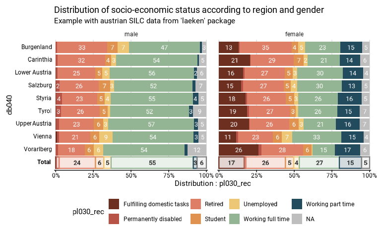

- `na.prop` indique la manière dont les éventuels `NA` sont traités dans
  les variables introduites dans `prop_exp`. Si l’argument prend la
  valeur `"rm"`, tous les `NA` présents dans au moins une des variable
  faisant partie de `prop_exp` sont exclus avant de procéder aux
  calculs. De cette manière, la proportion est calculée uniquement sur
  les observations “valides”. Dans ce cas, pour des raisons évidentes,
  il n’est pas possible d’utiliser la fonction
  [`is.na()`](https://rdrr.io/r/base/NA.html) dans `prop_exp` (on ne
  peut pas calculer la proportion de personnes dont le statut
  professionnel est `NA` si on a supprimé les `NA`). Précisons que
  l’exclusion des `NA` se fait avant le calcul de l’expression. Ainsi,
  si des fonctions dont le comportement attendu est d’inclure les `NA`
  sont indiquées dans l’argument `prop_exp`, par exemple `%in%`, elles
  ne fonctionnerons pas comme prévu, car les `NA` seront exclus avant
  que ces fonctions ne pourront les prendre en compte. Pour résumer,
  quand `na.prop` prend la valeur `"rm"` (ce qui se fait par défaut),
  toutes les observations pour lesquelles il y a au moins un `NA` pour
  une variable reprise dans `prop_exp` sont exclues avant que
  l’expression ne soit calculée. Par contre, si l’argument prend la
  valeur `"include"`, les `NA` ne sont pas retirés avant de procéder aux
  calculs et la proportion est calculée sur l’ensemble des observations,
  `NA` compris. Cela peut être utile quand les `NA` n’indiquent pas une
  valeur manquante mais une situation spécifique. Par exemple, dans une
  variable mesurant les points obtenu par des étudiants à un examen, le
  `NA` peut indiquer que l’étudiant était absent ; on peut donc vouloir
  calculer la proportion d’étudiants ayant au moins 12/20 en conservant
  les absents au dénominateur, ce qui est possible avec
  `na.prop = "include"`. Par défaut, `na.prop` prend la valeur `"rm"`.
  Précisons aussi que pour
  [`central_group()`](https://jgires.github.io/fonctionr/reference/central_group.md)
  et ses alias
  [`mean_group()`](https://jgires.github.io/fonctionr/reference/central_group.md)
  et
  [`median_group()`](https://jgires.github.io/fonctionr/reference/central_group.md),
  il n’y a pas d’argument permettant de choisir le traitement des `NA`
  dans `quanti_exp`. Les observations comprenant au moins un `NA` dans
  une variable indiquée dans `quanti_exp` sont automatiquement exclues
  des calculs, car il n’y a pas d’autre possibilité qui soit pertinente.

Les deux graphiques ci-dessous comparent la part de travailleurs selon
le sexe en excluant ou en incluant les `NA`. Les taux du second
graphique sont plus faible, car dans celui-ci les personnes n’ayant pas
de statut socio-professionnel (c’est-à-dire les enfants) sont
comptabilisées dans le dénominateur.

``` r
eusilc_prop_NA_excl <- prop_group(
  eusilc,
  group = rb090,
  prop_exp = pl030 == "1" | pl030 == "2",
  weights = rb050,
  na.prop = "rm",
  title = "% workers (NA excluded)"
)

eusilc_prop_NA_incl <- prop_group(
  eusilc,
  group = rb090,
  prop_exp = pl030 == "1" | pl030 == "2",
  weights = rb050,
  na.prop = "include",
  title = "% workers (NA included)"
)
```

``` r
eusilc_prop_NA_excl$graph | eusilc_prop_NA_incl$graph
```


- `na.vars` indique la manière dont les `NA` doivent être traités dans
  les différentes variables de
  [`many_val()`](https://jgires.github.io/fonctionr/reference/many_val.md)
  et
  [`many_val_group()`](https://jgires.github.io/fonctionr/reference/many_val_group.md).
  Si l’argument prend la valeur `"rm"`, les `NA` sont exclus séparément
  pour chaque variable. Il en résulte que l’échantillon ne sera pas
  toujours le même pour chacune des variables calculées, mais on
  conserve un maximum d’observations. Si l’argument prend la valeur
  `"rm.all"`, les observations qui comprennent au moins un `NA` dans
  n’importe quelle des variables de `list_vars` sont exclues. Cette
  manière de procéder exclut plus d’observations mais permet d’avoir un
  échantillon identique pour toutes les variables. Par défaut, `na.vars`
  prend la valeur `"rm"`.

### Les arguments esthétiques

Les arguments esthétiques sont des arguments qui affectent uniquement le
graphique produit et pas la table, ni le test statistique. Pour des
raisons pédagogiques, nous aborderons successivement les arguments
d’esthétique de base, d’esthétique graphique, d’esthétique des chiffres,
d’esthétique des lettres et les labels. Aucun de ces arguments n’est
obligatoire.

#### L’esthétique de base

- `reorder` est un argument qui, en prenant la valeur `TRUE`, permet de
  réordonner les catégories selon leur valeur décroissante. Si
  `reorder = FALSE`, les catégories ne sont pas réordonnées et c’est
  l’ordre des *levels* de la variable qui est utilisé si c’est un
  facteur, ou l’ordre alphabétique si c’est une variable string. La
  catégorie `NA` – quand elle existe (par exemple avec
  `na.rm.group = FALSE`) – et la catégorie “Total” ne sont jamais
  réordonnées et sont toujours positionnées dans le bas du graphique. En
  cas de facettes, les catégories sont réordonnées sur base de chaque
  catégorie médiane. Par exemple, si l’on utilise des facettes dans
  [`prop_group()`](https://jgires.github.io/fonctionr/reference/prop_group.md),
  la fonction identifie, pour chaque groupe, quelle est la proportion
  médiane par groupe et puis elle va ordonner les groupes sur bases de
  ces médianes. Par défaut, `reorder` prend la valeur de `FALSE`.
  `reorder` n’est pas disponible dans
  [`distrib_group_discrete()`](https://jgires.github.io/fonctionr/reference/distrib_group_discrete.md)
  et
  [`many_val_group()`](https://jgires.github.io/fonctionr/reference/many_val_group.md)
  ainsi que ses alias
  ([`many_prop_group()`](https://jgires.github.io/fonctionr/reference/many_val_group.md),
  [`many_mean_group()`](https://jgires.github.io/fonctionr/reference/many_val_group.md)
  et
  [`many_median_group()`](https://jgires.github.io/fonctionr/reference/many_val_group.md)),
  car il y a plusieurs proportions ou indicateurs et il est difficile de
  choisir sur laquelle ou lequel réordonner.

Dans l’exemple ci-dessous, les revenus moyens des statuts
socio-économiques sont réordonnés. Comme il y a des facettes, c’est le
médian de chaque catégorie (ici statut) qui est utilisée pour construire
l’ordre. Par exemple, la catégorie “Permanently disabled” se situe en
troisième position, car sa valeur médiane (15199€) se situe entre le
médian de la catégorie “Student” (15097€) et de la catégorie “Working
part time” (16511€).

``` r
eusilc_mean_reorder <- mean_group(
  eusilc,
  group = pl030_rec,
  quanti_exp = eqIncome,
  facet = pb220a,
  weights = rb050,
  reorder = TRUE,
  unit = "€",
  title = "Mean of eq. income by status and nationality",
  subtitle = "Example with austrian SILC data from 'laeken' package"
)
```

``` r
eusilc_mean_reorder$graph
```

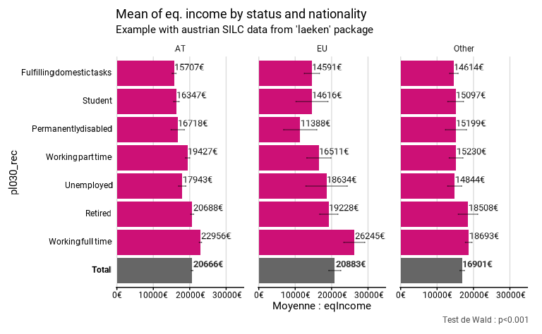

- `position` est un argument qui ne se trouve uniquement dans
  [`many_val_group()`](https://jgires.github.io/fonctionr/reference/many_val_group.md)
  et qui peut prendre les valeurs de `"dodge"` et de `"stack"`. Avec
  `"dodge"`, les barres ne sont pas empilées. Avec `"stack"`, les barres
  sont empilées dans chaque groupe. Cette option peut avoir un intérêt
  quand les variables ont vocation à être additionnées, par exemple avec
  des revenus selon différentes sources qui peuvent former un revenu
  total. `"dodge"` est la valeur par défaut.

Dans l’exemple ci-dessous, il est pertinent d’empiler les barres
indiquant les différents revenus pour visualiser le revenu total.
Cependant, dans ce cas, on peut plus indiquer les intervalles de
confiance sur le graphique.

``` r
#Exemple avec Stack 
eusilc_many_mean_group_2a <- many_mean_group(
  eusilc,
  group = rb090,
  list_vars = c(py010n, py050n, py090n),
  list_vars_lab = c("salaires", "revenus d'une activité indépendant", "allocation de chômage"),
  weights = rb050,
  position = "stack",
  title = "position = 'stack'",
  legend_ncol = 2
)
#Exemple avec dodge 
eusilc_many_mean_group_2b <- many_mean_group(
  eusilc,
  group = rb090,
  list_vars = c(py010n, py050n, py090n),
  list_vars_lab = c("salaires", "revenus d'une activité indépendant", "allocation de chômage"),
  weights = rb050,
  position = "dodge",
  title = "position = 'dodge'",
  legend_ncol = 2
)
```

``` r
eusilc_many_mean_group_2a$graph | eusilc_many_mean_group_2b$graph
```


- `show_ci`, `show_n`, `show_value` et `show_lab` permettent de montrer
  ou cacher différents éléments sur le graphique avec les valeurs `TRUE`
  et `FALSE` :

  - l’intervalle de confiance (`show_ci`),
  - le nombre de personnes dans l’échantillon (`show_n`),
  - l’estimation de l’indicateur (`show_value`)
  - les titres et sous-titres du graphiques, des axes et de la légende
    (`show_lab`).

Faute de représentation graphique adéquate, `show_ci` n’est pas un
argument de la fonction
[`distrib_group_discrete()`](https://jgires.github.io/fonctionr/reference/distrib_group_discrete.md).
Pour cette fonction, il est pas possible de représenter les intervalles
de confiance sur le graphique, mais ils sont bien calculé dans le
dataframe `tab`. C’est aussi le cas pour
[`many_val_group()`](https://jgires.github.io/fonctionr/reference/many_val_group.md)
et ses alias quand `position = "stack"`. Précisons aussi que dans
[`distrib_group_discrete()`](https://jgires.github.io/fonctionr/reference/distrib_group_discrete.md),
seules les valeurs supérieures à 2% sont indiquées sur le graphique pour
des raisons de lisibilité. Pour
[`distrib_continuous()`](https://jgires.github.io/fonctionr/reference/distrib_continuous.md) l’argument
`show_n` indique les effectifs de l’échantillon pour chaque quantile.

- `total_name` indique le nom qui doit être mentionné à côté du résultat
  du total dans le graphique. Par défaut, quand `lang = "fr"` (voir
  ci-dessous), il s’agit de “Total”, mais l’utilisateur peut indiquer
  autre chose de plus spécifique, par exemple “Belgique”, “Population
  active totale”, etc.

Dans l’exemple ci-dessous, on ne montre plus les intervalles de
confiances, les valeurs de l’indicateur et les labels des titres, par
contre on montre le nombre de personnes dans l’échantillon et on a
changé le nom du “Total”.

``` r
eusilc_prop <- prop_group(
  eusilc,
  group = db040,
  prop_exp = pl030 == "1" | pl030 == "2",
  weights = rb050,
  show_ci = FALSE,
  show_n = TRUE,
  show_value = FALSE,
  show_lab = FALSE,
  total_name = "Total Austria"
)
```

``` r
eusilc_prop$graph
```

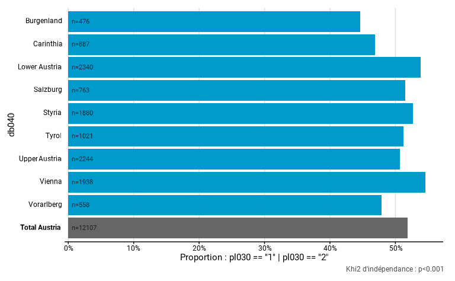

Certains arguments sont spécifiques aux fonctions `distrib_continous()`
et `distrib_group_continous()` :

- `height` indique la hauteur des courbes de densité dans
  [`distrib_group_continuous()`](https://jgires.github.io/fonctionr/reference/distrib_group_continuous.md).
  Une valeur plus élevée mènent à des courbes plus hautes qui peuvent
  éventuellement se chevaucher. La valeur par défaut est 0.8.

- `limits` indique les limites de l’axe des abscisses du graphique . Par
  défaut, il n’y a pas de limites, ce qui revient à montrer sur le
  graphique la totalité de la distribution. Cependant, cela peut poser
  problème pour des distributions asymétriques avec quelques valeurs
  extrêmes, par exemple pour les variables de revenu. `limits` permet de
  zoomer sur la partie du graphique la plus intéressante qui reprend la
  majorité des observations. Précisons qu’il ne s’agit pas d’un filtre,
  mais d’un zoom : les déciles, valeurs centrales et moustaches sont
  toujours calculées sur l’ensemble de la distribution. En cas
  d’utilisation de zoom important, il est conseillé d’utiliser une
  résolution plus élevée. A noter que lorsque `show_n = TRUE` pour
  `distrib_continous()`, on n’indique pas les effectifs pour les
  quantiles qui ne sont pas complètement représentés quand on utilise
  l’argument `limits`.

- D’autres arguments de type `show_*` sont spécifiques à ces deux
  fonctions. C’est le cas de `show_mid_line`, `show_ci_lines`,
  `show_ci_area`, `show_quant_lines` qui se retrouvent dans les deux
  fonctions de distribution continue et `show_mid_point`,
  `show_ci_errorbar` et `show_moustache` qui sont spécifiques à
  [`distrib_group_continuous()`](https://jgires.github.io/fonctionr/reference/distrib_group_continuous.md).

  - `show_mid_point` et `show_mid_line` permettent de montrer la valeur
    centrale, médiane ou moyenne, sous la forme d’un point ou d’une
    ligne.
  - `show_ci_errorbar`, `show_ci_lines` et `show_ci_area` permettent de
    montrer l’intervalle de confiance de la valeur centrale sous la
    forme d’une barre d’erreur, de lignes en pointillé, ou d’une aire
    colorée.
  - `show_quant_lines` permet de tracer des lignes pour les valeurs des
    quantiles sur le graphique.
  - `show_moustache` permet de montrer la boite à moustache.

Par défaut,
[`distrib_continuous()`](https://jgires.github.io/fonctionr/reference/distrib_continuous.md)
indique la la valeur centrale par une ligne et ses intervalles de
confiance par des lignes pointillées et ne trace pas de ligne pour les
quantiles. Par défaut,
[`distrib_group_continuous()`](https://jgires.github.io/fonctionr/reference/distrib_group_continuous.md)
indique les valeurs centrales par des points et leurs intervalles de
confiance par des barres d’erreurs, et ne dessine pas d’autres éléments
que la moustache sur le graphique .

Dans l’exemple ci-dessous, nous comparons les revenus du travail des
travailleurs à temps partiel selon la région, en modifiant de nombreuses
options graphiques. `bw` étant plus faible, la distribution est moins
lissée et on peut y observer des variations de densités plus locales.
`resolution` étant plus faible, on peut déceler les droites qui
composent les courbes de densité. `limits` permet de se concentrer sur
la plage de valeur (de -500€ à 3000€) qui contient la grande majorité
des observations. `height` a été défini pour que les aires de densité se
chevauchent. Pour que ce chevauchement soit esthétique, `alpha` a été
réglé à `.3` pour des aires transparentes et une bordure a été ajoutée
avec `color = black` – ces deux arguments seront détaillés plus bas. On
a indiqué la médiane sous la forme d’une ligne. Ses intervalles de
confiance sont indiqués par deux lignes en pointillées et une aire
colorées. Les déciles sont indiqués par des lignes verticales grises et
on a masqué la moustache. Notez que le revenu du travail mensuel est
directement calculé dans l’expression en additionnant le salaire avec le
revenu d’une activité indépendante avant de diviser le tout par 12.

``` r
distrib_income_2 <- distrib_group_c(
  eusilc,
  db040,
  (py010n + py050n) / 12,
  filter_exp = pl030 == 2,
  bw = .7,
  resolution = 50,
  height = 1.5,
  limits = c(-500, 3000),
  show_mid_point = F,
  show_value = F,
  show_mid_line = T,
  show_ci_errorbar = F,
  show_ci_lines = T,
  show_ci_area = T,
  show_quant_lines = T,
  show_moustache = F,
  color = "black",
  pal = "purple",
  alpha = .4
)
```

``` r
distrib_income_2$graph
```

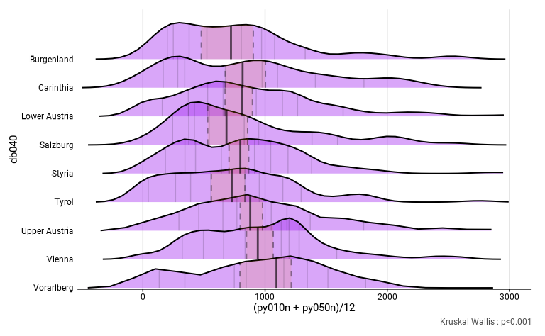

#### L’esthétique graphique

`dodge` indique l’épaisseur des barres et peut aller de `0` (barre
invisible car d’épaisseur nulle) à `1` (barre se touchant car ne
laissant aucun espace entre elles). La valeur par défaut est de `0.9`.

Les couleurs des barres sont indiquées dans l’argument `pal`.

- Dans les graphiques monochrome, `pal` peut prendre la valeur d’une
  couleur de base de R ou d’un code couleur hexadécimal. C’est le cas
  pour
  [`distrib_discrete()`](https://jgires.github.io/fonctionr/reference/distrib_discrete.md),
  [`prop_group()`](https://jgires.github.io/fonctionr/reference/prop_group.md)
  et
  [`central_group()`](https://jgires.github.io/fonctionr/reference/central_group.md)
  quand il n’y a pas de `group.fill`.

- Dans les graphiques avec une palette de couleurs différentes, `pal`
  doit prendre le nom d’une palette des packages `MetBrewer`,
  `MoMAColors` ou `PrettyCols` (sauf pour la distribution d’une variable
  quantitative, voir ci-dessous). L’argument `direction` permet
  d’inverser le sens de la palette, en remplaçant le `1`, par défaut,
  par `-1` pour avoir le sens opposé. C’est le cas de
  [`distrib_group_discrete()`](https://jgires.github.io/fonctionr/reference/distrib_group_discrete.md),
  [`many_val_group()`](https://jgires.github.io/fonctionr/reference/many_val_group.md),
  et de
  [`prop_group()`](https://jgires.github.io/fonctionr/reference/prop_group.md)
  et
  [`central_group()`](https://jgires.github.io/fonctionr/reference/central_group.md)
  quand il y a un `group.fill`.

- Dans
  [`many_val()`](https://jgires.github.io/fonctionr/reference/many_val.md)
  et ses alias, on peut indiquer dans `pal` soit une couleur unique,
  soit une palette des packages `MetBrewer`, `MoMAColors` ou
  `PrettyCols`. Cela permet de choisir de produire un graphique
  monochrome, ou un graphique qui différencie chromatiquement chaque
  variable.

- Les couleurs des `NA` et des totaux, quand ils sont présents, ne sont
  pas modifiables directement par l’utilisateur. La modalité `NA` est
  toujours grise (`grey`). Le total est coloré de deux manière selon
  qu’il existe un seul total (dans les graphiques monochromes comme
  [`prop_group()`](https://jgires.github.io/fonctionr/reference/prop_group.md)
  et
  [`central_group()`](https://jgires.github.io/fonctionr/reference/central_group.md)
  quand il n’y a pas d’argument `group.fill`) ou qu’il existe des totaux
  différents pour chaque modalité ou variable (dans les graphiques avec
  palette de couleur, comme
  [`distrib_group_d()`](https://jgires.github.io/fonctionr/reference/distrib_group_discrete.md),
  [`many_val_group()`](https://jgires.github.io/fonctionr/reference/many_val_group.md),
  de
  [`prop_group()`](https://jgires.github.io/fonctionr/reference/prop_group.md)
  et
  [`central_group()`](https://jgires.github.io/fonctionr/reference/central_group.md)
  quand il y a un argument `group.fill`). Dans le premier cas, la
  couleur est gris foncé (`grey40`). Dans le second cas, chaque total a
  une bordure de la couleur de sa modalité ou variable et a une couleur
  de remplissage identique mais plus claire.

- Par défaut, des couleurs ou des palettes de couleurs différentes ont
  été choisies pour chacune des fonctions, y compris les alias, pour
  éviter une confusion entre graphiques différents.

Dans l’exemple ci-dessous, on compare deux graphiques issus de
[`prop_group()`](https://jgires.github.io/fonctionr/reference/prop_group.md)
: l’un avec l’argument `group.fill`, et l’autre sans. On calcule la
proportion de travailleurs à temps partiel selon la nationalité. Dans le
premier graphique, on différencie les proportions selon le sexe; `pal`
prend alors le nom d’une palette (ici `"Neon"` de `PrettyCols` a été
indiquée). En outre, dans ce premier graphique, les barres sont plus
fines (`dodge` prend une valeur de 0.7). Dans le deuxième, il n’y a pas
de sous-groupes. `pal` n’a alors besoin que d’une unique couleur, et on
a indiqué la couleur de base de R `"gold"`. On remarque aussi les deux
manières différentes dont les totaux sont représentés.

``` r
# Avec sous-groupes
eusilc_prop_sub_group <- prop_group(
  eusilc,
  group =pb220a ,
  prop_exp = pl030_rec == "Working part time",
  group.fill = rb090,
  weights = rb050,
  title = "% of ind. working part time by nationality & sex",
  subtitle = "(with sub-groups)",
  pal = "Neon",
  dodge = .7
)
# Sans sous-groupes
eusilc_prop_no_sub_group <- prop_group(
  eusilc,
  group = pb220a,
  prop_exp = pl030_rec == "Working part time",
  weights = rb050,
  title = "% of ind. working part time by nationality",
  subtitle = "(no sub-groups)",
  pal = "gold"
)
```

``` r
eusilc_prop_sub_group$graph | eusilc_prop_no_sub_group$graph
```


- Dans
  [`distrib_continuous()`](https://jgires.github.io/fonctionr/reference/distrib_continuous.md)
  et
  [`distrib_group_continuous()`](https://jgires.github.io/fonctionr/reference/distrib_group_continuous.md),
  `pal` peut soit prendre la valeur d’une couleur, soit un vecteur
  reprenant plusieurs couleurs. Dans le cas d’une seule couleur, les
  graphiques seront monochrome, dans le cas de plusieurs couleurs, une
  palette de couleur est créée en passant par les différentes couleurs
  indiquées pour colorer les différents quantiles, la première couleur
  indiquant la coloration des premiers et derniers quantiles, et la
  dernière couleur indiquant la coloration du quantile central[⁶](#fn6).
  Précisons que le vecteur de `pal` doit être un vecteur de couleur de R
  ou de codes hexadécimaux, mais pas une des palettes des packages
  `MetBrewer`, `MoMAColors` ou `PrettyCols` utilisées dans `pal` pour
  les autres fonctions. Par défaut
  [`distrib_continuous()`](https://jgires.github.io/fonctionr/reference/distrib_continuous.md)
  utilise un dégradé de bleu pour les quantiles et
  [`distrib_group_continuous()`](https://jgires.github.io/fonctionr/reference/distrib_group_continuous.md)
  colorie les courbes de densité en gris, de manière à ne pas surcharger
  le graphique avec les quantiles. Ces deux fonction ont aussi
  l’argument `color` qui permet de définir la couleur de la ligne
  supérieure de la courbe de densité. Par défaut cette ligne n’est pas
  affichée.

- [`distrib_group_continuous()`](https://jgires.github.io/fonctionr/reference/distrib_group_continuous.md)
  comprend aussi l’argument `pal_moustache` qui détermine les couleurs
  de la moustache et `alpha` qui détermine la transparence de la couleur
  de la densité. `pal_moustache` fonctionne comme `pal` et peut
  comprendre une couleur unie ou un vecteur de couleur. Mais
  logiquement, il n’est pas pertinent de représenter une moustache
  monochrome. Comme pour pour `pal`, il n’est pas nécessaire de définir
  chaque teinte de couleur individuellement, puisque la fonction produit
  une palette de couleur comprenant tous les dégradés nécessaires.
  `alpha` peut prendre une valeur allant de 0 (couleur totalement
  transparente et donc invisible) à 1 (couleur sans transparence). Avoir
  un certain degré de transparence est particulièrement utile si les
  différentes courbes se superposent (quand `height` est élevé).

Dans l’exemple ci-dessous, on utilise trois couleurs pour construire la
palette qui va colorier l’aire de la densité et on trace la courbe de
densité en rouge.

``` r
distrib_age_2 <- distrib_c(
  eusilc,
  age,
  type = "mean",
  quantiles = seq(.05, .95, .05),
  limits = c(10, 100),
  color = "red",
  pal = c("purple", "green3", "orange"),
  show_n = T
)
```

``` r
distrib_age_2$graph
```

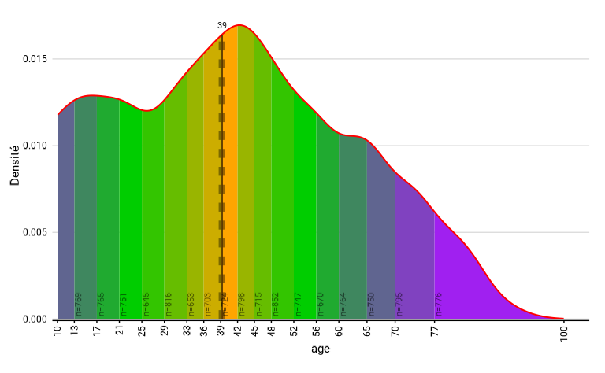

#### L’esthétique des chiffres

L’esthétique des chiffres concernent la manière dont l’estimation de
l’indicateur est affichée sur le graphique. Ainsi, ces arguments n’ont
une utilité que si `show_value = TRUE`.

- `scale` est un argument qui n’est utilisé que dans les graphique
  exprimant des proportion. Il indique le dénominateur par lequel il
  faut interpréter le chiffre. Par défaut, `scale = 100` pour
  interpréter les chiffres mentionnés en pourcentage. On peut donner par
  exemple une valeur de `1000` pour interpréter les chiffres en pour
  mille ou une valeur de `1` pour interpréter les chiffres comme de
  simple proportions.

- `digits` indique le nombre de décimales qui doivent être affichées
  pour les valeurs sur le graphique. Par défaut, `digit = 0`, ce qui
  conduit à ne pas afficher de décimales.

- `unit` indique l’unité à indiquer sur le graphique. Pour
  [`distrib_discrete()`](https://jgires.github.io/fonctionr/reference/distrib_discrete.md),
  [`prop_group()`](https://jgires.github.io/fonctionr/reference/prop_group.md),
  [`many_prop()`](https://jgires.github.io/fonctionr/reference/many_val.md)
  et `many_prop_group(`), par défaut `unit = "%"`. Pour les autres
  fonction, par défaut `unit = NULL`, c’est-à-dire une absence d’unité
  indiquée sur le graphique. N’importe quel caractère ou chaîne de
  caractère peut être utilisée : `"€"`, `"m²"`, etc.

- `dec` indique le caractère qui doit être utilisé pour marquer la
  décimale dans les chiffes. Cet argument n’est utile que quand `digits`
  est supérieur à 0. Par défaut, `dec = ","`, parce que la virgule est
  le caractère le plus utilisé pour marquer la décimale dans le monde
  francophone.

Dans l’exemple ci-dessous, on compare la proportion de travailleurs par
région, mais en l’exprimant en pour mille et non en pour cent, en
adaptant l’unité (`"‰"`), en conservant un chiffre après la virgule et
en utilisant le point comme caractère pour la décimale et non la
virgule.

``` r
eusilc_prop <- prop_group(
  eusilc,
  group = db040,
  prop_exp = pl030 == "1" | pl030 == "2",
  weights = rb050,
  scale = 1000,
  digits = 1,
  unit = "‰",
  dec = ".",
  title = "Proportion of workers by region, in ‰",
  subtitle = "Example with austrian SILC data from 'laeken' package"
)
```

``` r
eusilc_prop$graph
```


#### L’esthétique des lettres

- `font` indique la police qui est utilisée pour l’ensemble du texte
  dans le graphique. Plusieurs polices sont directement incluses dans
  `fonctionr` afin qu’elles soient utilisables sur tous les systèmes.
  Pour prendre connaissance des polices disponibles, voir
  [`load_and_active_fonts()`](https://jgires.github.io/fonctionr/reference/load_and_active_fonts.md).

- `wrap_width_y` et `wrap_width_leg` indiquent le nombre de caractères
  avant d’aller à la ligne, pour respectivement les différent labels de
  l’axe des ordonnées et les différents labels de la légende. Ces
  valeurs sont par défaut de 25 caractères. `wrap_width_leg` n’est
  présent que pour les graphiques ayant une légende :
  [`distrib_group_discrete()`](https://jgires.github.io/fonctionr/reference/distrib_group_discrete.md),
  [`many_val_group()`](https://jgires.github.io/fonctionr/reference/many_val_group.md)
  et ses alias et
  [`prop_group()`](https://jgires.github.io/fonctionr/reference/prop_group.md)
  et
  [`central_group()`](https://jgires.github.io/fonctionr/reference/central_group.md)
  quand il y a un argument `group.fill`). Précisons aussi que le `_y`
  renvoie à l’axe des y tel qu’il est situé sur le graphique, après la
  transformation
  [`coord_flip()`](https://ggplot2.tidyverse.org/reference/coord_flip.html)
  qui a lieu dans les fonctions. Ainsi, il s’agit souvent des groupes,
  de la variable qualitative pour
  [`distrib_discrete()`](https://jgires.github.io/fonctionr/reference/distrib_discrete.md)
  ou de la liste des variables pour
  [`many_val()`](https://jgires.github.io/fonctionr/reference/many_val.md)
  et `many_val_group(`) et leurs alias.

- `legend_ncol` indique le nombre maximum de colonnes dans la légende.
  Par défaut, il y a quatre colonnes maximum. Le nombre de lignes dans
  la légende s’ajuste au nombre maximum de colonnes. Comme
  `wrap_width_leg` , `legend_ncol` n’est présent que pour les graphiques
  ayant une légende : `distrib_group_discrete(`) et
  [`many_val_group()`](https://jgires.github.io/fonctionr/reference/many_val_group.md)
  et ses alias et
  [`prop_group()`](https://jgires.github.io/fonctionr/reference/prop_group.md)
  et
  [`central_group()`](https://jgires.github.io/fonctionr/reference/central_group.md)
  quand il y a un argument `group.fill`.

#### Les labels

Les arguments de label ne sont utilisés que si `show_lab = TRUE`, qui
est la valeur par défaut. Si `show_lab = FALSE`, aucun des labels
ci-dessous n’est indiqué.

- `title`, `subtitle`, `xlab`, `ylab`, `legend_lab` et `caption`
  indiquent les textes à reprendre comme titre du graphique, sous-titre
  du graphique, titre de l’axe des abscisses, titre de l’axe des
  ordonnées, titre de la légende et de *caption* (la petite légende en
  bas à droite du graphique). Précisons que `xlab` et `ylab` font
  référence aux axes tels qu’ils sont situés sur le graphique,
  c’est-à-dire après la transformation
  [`coord_flip()`](https://ggplot2.tidyverse.org/reference/coord_flip.html)
  qui a lieu dans les fonctions. `legend_lab` n’est présent que pour les
  graphiques ayant une légende :
  [`distrib_group_discrete()`](https://jgires.github.io/fonctionr/reference/distrib_group_discrete.md)
  et
  [`many_val_group()`](https://jgires.github.io/fonctionr/reference/many_val_group.md)
  ainsi que ses alias et
  [`prop_group()`](https://jgires.github.io/fonctionr/reference/prop_group.md)
  et
  [`central_group()`](https://jgires.github.io/fonctionr/reference/central_group.md)
  quand il y a un argument `group.fill`. Le *caption* étant souvent déjà
  utilisé pour indiquer la p valeur du test statistique, l’argument
  `caption` ajoute un texte en dessous de la mention de la p valeur du
  test statistique.

- Dans le cas où les arguments de label ne sont pas renseignés par
  l’utilisateur, il n’y a pas de titre, pas de sous-titre et pas de
  *caption* (autre que la p valeur du test statistique). Par contre,
  `xlab`, `ylab` et, pour les graphiques avec légende, `legend_lab`
  indiquent par défaut les noms de la variable ou de l’expression qui
  est, pour `xlab`, précédé d’une précision sur la nature du calcul :
  “Moyenne : …”, “Distribution : …”

- Il est possible d’indiquer certains label et d’autres non, par exemple
  si l’on souhaite un titre mais pas de sous-titre. Il suffit de ne
  compléter que les arguments de labels que l’on souhaite voir écrits
  sur le graphique. Cependant, pour `xlab`, `ylab` et `legend_lab`, le
  label par défaut, basé sur le nom des variables, est alors écrit sur
  le graphique. Si l’on souhaite avoir un label vide, il faut indiquer,
  respectivement, `xlab = ""`, `ylab =""` ou `legend_lab = ""`.
  L’utilisation de `xlab = NULL`, `ylab = NULL` ou `legend_lab = NULL`
  conduira à l’écriture du label par défaut.

- On peut aussi mentionner l’argument `lists_vars_lab` que l’on a déjà
  expliqué plus haut et qui peut être aussi considéré comme un label.

- L’argument `lang` permet de déterminer la langue des textes
  automatiques. Trois valeurs sont possibles : `lang = "fr"` pour le
  français, `lang = "nl"` pour le néerlandais et `lang = "en"` pour
  l’anglais. Par défaut, c’est le français qui est utilisé.

- L’argument `coef_font` permet de modifier la taille de l’ensemble des
  labels (titres, légendes, valeurs…) écrits sur le graphique. Cela peut
  être utile quand le graphique doit être exporté dans une publication,
  par exemple à l’aide d’un document quarto. Par défaut, il vaut 1. Une
  valeur supérieure à 1 permet d’augmenter la taille de tous les textes
  présents sur le graphique alors qu’une valeur inférieure à 1 permet de
  la diminuer.

- L’argument `theme`, qui est un argument d’esthétique graphique plutôt
  que de label, permet de modifier le thème du graphique. Le thème de
  base (`theme = NULL`) est celui qu’on retrouve dans tous les
  graphiques dans ce document, mais le thème IWEPS (`theme = "IWEPS"`)
  permet d’ajouter un axe gradué pour les ordonnées.

Dans l’exemple ci-dessous, on a changé la police (Montserrat), on a mis
à la ligne les labels de l’ordonnée à partir de 10 caractères et ceux de
la légende à partir de 15 caractères et on a limité à trois colonnes
pour la légende. On a également introduit manuellement les titres,
sous-titres, *caption* et titre de légende, en conservant le label par
défaut pour le titre de l’axe des abscisses et en n’ayant pas de titre
pour l’axe des ordonnées. La langue des textes automatiques est le
néerlandais et l’on a tracé l’axe des ordonnées (`theme = "IWEPS"`).

``` r
eusilc_dist_group_d <- distrib_group_d(
  eusilc,
  group = db040,
  quali_var = pl030_rec,
  weights = rb050,
  font = "Montserrat",
  wrap_width_y = 10,
  wrap_width_leg = 15,
  legend_ncol = 3,
  title = "Distribution of socio-economic status according to region",
  subtitle = "Example with austrian SILC data from 'laeken' package",
  ylab = "",
  legend_lab = "Status",
  caption = "Bron : EU-SILC",
  lang = "nl",
  theme = "IWEPS"
)
```

``` r
eusilc_dist_group_d$graph
```


## Programmer avec `fonctionr`

Pour le moment, il n’est pas possible de programmer avec `fonctionr` ;
il n’est par exemple pas possible d’utiliser les fonctions de
`fonctionr` dans une boucle. Nos fonctions ont initialement été écrites
dans la visée d’un usage interactif, c’est-à-dire d’un maniement direct
pas l’utilisateur et non *via* une boucle ou d’autres fonctions. Il
s’agit d’une limite provoquée par le fait que les variables et
expressions s’écrivent en utilisant le [data
masking](https://dplyr.tidyverse.org/articles/programming.html), à la
manière du `tidyverse`, impliquant l’utilisation de la [non-standard
evaluation](https://adv-r.hadley.nz/metaprogramming.html) dans le code
des fonctions. Si cette possibilité rend l’utilisation courante plus
simple (raison pour laquelle cette écriture a été choisie), elle
complexifie largement l’écriture du code des fonctions pour nous.

A terme, nous avons la volonté de modifier ce comportement pour rendre
possible l’utilisation non-interactive de nos fonctions. Néanmoins, cela
va nous demander un travail certain, n’étant pas programmeurs de
profession. Si vous êtes intéressé-e par le concept de `fonctionr` et
connaissez ces questions - notamment la programmation avec
[`rlang`](https://rlang.r-lib.org/) -, ou êtes intéressé-es d’y
réfléchir, nous accueillerons votre aide avec grand plaisir !

------------------------------------------------------------------------

1.  Précisons que dans cet exemple, il n’y a pas de plan de sondage qui
    est mentionné. Seule la variable de pondération est introduite. Nous
    aborderons ce point ultérieurement.

2.  Les personnes exclues, parce que, par exemple, la variable
    dichotomique prend une valeur `NA` et que l’on a décidé de ne pas
    les prendre en compte, ne sont pas reprises dans `n_tot_weighted,`
    de manière à ce que le ratio entre `n_true_weighted` et
    `n_tot_weighted` soit égal à `prop`. La question de l’exclusion de
    certaines personnes de l’échantillon est abordée en détail dans la
    section traitant des arguments clés.

3.  Voir :
    <https://stackoverflow.com/questions/72843411/one-way-anova-using-the-survey-package-in-r>

4.  Voir :
    <https://notstatschat.rbind.io/2021/07/22/subsets-and-subpopulations-in-survey-inference/>

5.  Voir :
    <https://search.r-project.org/CRAN/refmans/survey/html/svyciprop.html>

6.  En cas d’un nombre pair de quantiles, par exemple pour des déciles
    ou des quartiles, les deux catégories centrales prennent des
    couleurs différentes : c’est celle du haut qui prend la couleur
    indiquée en dernière position du vecteur `pal`.
